# Universal AI Tools - Complete Architecture Visual Map

## Level 1: High-Level System Architecture

```mermaid
graph TB
    subgraph "Client Layer"
        UI[React Frontend<br/>Spectrum UI]
        iOS[iOS Companion App<br/>SwiftUI]
        API_CLIENT[API Clients<br/>REST/WebSocket]
    end
    
    subgraph "Server Layer"
        EXPRESS[Express.js Server<br/>Port 9999]
        WS[WebSocket Server<br/>Socket.IO]
        AUTH[Authentication<br/>JWT + Device Auth]
    end
    
    subgraph "Service Layer"
        AGENTS[Agent Registry<br/>6 Enhanced Agents]
        MCP[MCP Integration<br/>Context Management]
        VAULT[Supabase Vault<br/>Secrets Management]
    end
    
    subgraph "Data Layer"
        SUPABASE[(Supabase<br/>PostgreSQL + Vector)]
        REDIS[(Redis<br/>Caching)]
        FILES[File System<br/>Local Storage]
    end
    
    UI --> EXPRESS
    iOS --> EXPRESS
    API_CLIENT --> EXPRESS
    EXPRESS --> WS
    EXPRESS --> AUTH
    EXPRESS --> AGENTS
    EXPRESS --> MCP
    EXPRESS --> VAULT
    AGENTS --> SUPABASE
    MCP --> SUPABASE
    VAULT --> SUPABASE
    EXPRESS --> REDIS
    EXPRESS --> FILES
```



## Level 2: Detailed Service Architecture


## Level 3: API Router Architecture

```mermaid
graph TB
    subgraph "API v1 Routes"
        BASE[/api/v1]
        CHAT[/api/v1/chat<br/>Chat Router]
        AGENTS_API[/api/v1/agents<br/>Agent Router]
        MEMORY_API[/api/v1/memory<br/>Memory Router]
        VISION_API[/api/v1/vision<br/>Vision Router]
        MCP_API[/api/v1/mcp<br/>MCP Agent Router]
        MLX_API[/api/v1/mlx<br/>MLX Router]
        AUTH_API[/api/v1/device-auth<br/>Device Auth Router]
        SECRETS_API[/api/v1/secrets<br/>Secrets Router]
        KNOWLEDGE_API[/api/v1/knowledge<br/>Knowledge Router]
        MONITORING_API[/api/v1/monitoring<br/>Monitoring Router]
        SYSTEM_API[/api/v1/system<br/>System Metrics Router]
    end
    
    subgraph "Specialized Routes"
        AB_MCTS[/api/v1/ab-mcts<br/>AB-MCTS Orchestration]
        HUGGINGFACE[/api/v1/huggingface<br/>HuggingFace Integration]
        SPEECH[/api/speech<br/>Speech/Voice Router]
        FAST_COORD[/api/v1/fast-coordinator<br/>Multi-Tier LLM]
    end
    
    subgraph "WebSocket Endpoints"
        WS_DEVICE[/ws/device-auth<br/>Device Authentication]
        WS_GENERAL[WebSocket Events<br/>ping/pong, connect/disconnect]
    end
    
    BASE --> CHAT
    BASE --> AGENTS_API
    BASE --> MEMORY_API
    BASE --> VISION_API
    BASE --> MCP_API
    BASE --> MLX_API
    BASE --> AUTH_API
    BASE --> SECRETS_API
    BASE --> KNOWLEDGE_API
    BASE --> MONITORING_API
    BASE --> SYSTEM_API
    BASE --> AB_MCTS
    BASE --> HUGGINGFACE
    BASE --> SPEECH
    BASE --> FAST_COORD
```

## Level 4: Database Schema Architecture


## Level 5: Service Integration Flow


## Level 6: Error Handling & Monitoring Flow


## Level 7: Frontend Integration Architecture

```mermaid
graph TB
    subgraph "React Frontend (ui/src/)"
        APP[App.tsx<br/>Router Provider]
        DASHBOARD[DashboardModern.tsx]
        CHAT[ChatModern.tsx]
        AGENTS_UI[Agents.tsx]
        MEMORY_UI[Memory.tsx]
        VISION_UI[VisionStudio.tsx]
        MONITORING_UI[MonitoringDashboard.tsx]
    end
    
    subgraph "API Integration"
        API_LIB[lib/api.ts]
        API_ENHANCED[lib/api-enhanced.ts]
        SUPABASE_CLIENT[lib/supabase.ts]
    end
    
    subgraph "State Management"
        STORE[store/index.ts]
        HOOKS[hooks/<br/>useChat, useSystemStatus]
        CONTEXT[contexts/AuthContext]
    end
    
    subgraph "Backend APIs"
        BACKEND_CHAT[/api/v1/chat]
        BACKEND_STATUS[/api/v1/status]
        BACKEND_MCP[/api/v1/mcp]
        BACKEND_AGENTS[/api/v1/agents]
        BACKEND_MEMORY[/api/v1/memory]
    end
    
    APP --> DASHBOARD
    APP --> CHAT
    APP --> AGENTS_UI
    APP --> MEMORY_UI
    APP --> VISION_UI
    APP --> MONITORING_UI
    
    DASHBOARD --> API_LIB
    CHAT --> API_ENHANCED
    AGENTS_UI --> API_LIB
    
    API_LIB --> BACKEND_CHAT
    API_LIB --> BACKEND_STATUS
    API_LIB --> BACKEND_MCP
    API_ENHANCED --> BACKEND_AGENTS
    API_ENHANCED --> BACKEND_MEMORY
    
    STORE --> HOOKS
    HOOKS --> CONTEXT
    CONTEXT --> SUPABASE_CLIENT
```

## Level 8: iOS Companion App Architecture

```mermaid
graph TB
    subgraph "SwiftUI App Structure"
        APP_SWIFT[UniversalAICompanionApp.swift]
        CONTENT[ContentView.swift]
        AUTH_VIEW[AuthenticationView.swift]
        ANIMATED_STATUS[AnimatedAuthenticationStatusView.swift]
    end
    
    subgraph "Core Services"
        DEVICE_AUTH[DeviceAuthenticationManager.swift]
        PROXIMITY[ProximityDetectionService.swift]
        WATCH_CONN[WatchConnectivityService.swift]
        IMAGE_CACHE[ImageCacheManager.swift]
    end
    
    subgraph "Apple Frameworks"
        CORE_BT[CoreBluetooth<br/>BLE Communication]
        LOCAL_AUTH[LocalAuthentication<br/>Biometric Auth]
        WATCH_KIT[WatchConnectivity<br/>Apple Watch]
        SECURITY[Security Framework<br/>Keychain]
    end
    
    subgraph "Backend Integration"
        DEVICE_API[/api/v1/device-auth<br/>Registration/Challenge]
        WS_DEVICE_API[/ws/device-auth<br/>Real-time Events]
        JWT_TOKENS[JWT Token Exchange]
    end
    
    APP_SWIFT --> CONTENT
    CONTENT --> AUTH_VIEW
    AUTH_VIEW --> ANIMATED_STATUS
    
    AUTH_VIEW --> DEVICE_AUTH
    DEVICE_AUTH --> PROXIMITY
    DEVICE_AUTH --> WATCH_CONN
    CONTENT --> IMAGE_CACHE
    
    DEVICE_AUTH --> CORE_BT
    DEVICE_AUTH --> LOCAL_AUTH
    WATCH_CONN --> WATCH_KIT
    DEVICE_AUTH --> SECURITY
    
    DEVICE_AUTH --> DEVICE_API
    PROXIMITY --> WS_DEVICE_API
    DEVICE_API --> JWT_TOKENS
```

## Level 9: Security & Authentication Flow


## Summary

This comprehensive architecture map shows how Universal AI Tools connects all frameworks across 9 detailed levels:

1. **High-Level System** - Client, Server, Service, Data layers
2. **Service Architecture** - Express core, agents, AI services, infrastructure  
3. **API Routes** - All REST endpoints and WebSocket connections
4. **Database Schema** - Complete table relationships and data flow
5. **Service Integration** - Request/response flow between components
6. **Error Handling** - Comprehensive error processing and monitoring
7. **Frontend Integration** - React app structure and API connections
8. **iOS Companion** - SwiftUI app with Apple framework integration
9. **Security Flow** - Authentication, secrets, and security monitoring

Each level shows the specific connections and data flow, providing a complete visual understanding of how all frameworks interconnect in the Universal AI Tools ecosystem.