# 🚀 BMAD Comprehensive Visual Roadmap & Implementation Plan

## 🎯 Vision: The Ultimate AI-Driven Development Platform

Transform BMAD from a workflow system into a **comprehensive AI development ecosystem** that can build anything from simple widgets to enterprise applications with complete context understanding.

---

## 📊 System Architecture Overview

```mermaid
graph TB
    subgraph "User Interface Layer"
        UI[🎨 Universal AI Tools UI]
        CLI[💻 Command Line Interface]
        API[🔌 REST API Gateway]
    end
    
    subgraph "BMAD Core Engine"
        PQ[🧠 Priming Questions Engine]
        WF[⚙️ Workflow Orchestrator]
        AG[🤖 Agent Collaboration Hub]
        CE[📚 Context Engine]
    end
    
    subgraph "AI Services Layer"
        LLM[🧠 LLM Router & Context Manager]
        MLX[🍎 MLX Inference Engine]
        VLM[👁️ Vision Language Models]
        DSPy[🔬 DSPy Orchestration]
    end
    
    subgraph "Knowledge & Memory"
        KB[📖 Knowledge Base]
        MEM[🧠 Memory Service]
        VEC[🔍 Vector Search]
        PAT[📋 Pattern Learning]
    end
    
    subgraph "Development Tools"
        GEN[⚡ Code Generation]
        TEST[🧪 Test Generation]
        DOC[📝 Documentation]
        DEP[🚀 Deployment]
    end
    
    subgraph "External Integrations"
        GH[🐙 GitHub Integration]
        WEB[🌐 Web Scraping]
        AUTH[🔐 Authentication]
        CLOUD[☁️ Cloud Services]
    end
    
    UI --> PQ
    CLI --> WF
    API --> AG
    
    PQ --> WF
    WF --> AG
    AG --> CE
    
    AG --> LLM
    LLM --> MLX
    LLM --> VLM
    LLM --> DSPy
    
    CE --> KB
    KB --> MEM
    MEM --> VEC
    VEC --> PAT
    
    AG --> GEN
    GEN --> TEST
    TEST --> DOC
    DOC --> DEP
    
    WF --> GH
    WF --> WEB
    WEB --> AUTH
    AUTH --> CLOUD
```



---

## 🔄 BMAD Workflow with Priming Questions

```mermaid
flowchart TD
    START([🚀 User Starts Project]) --> PQ[🧠 Priming Questions Engine]
    
    PQ --> Q1[📝 Project Basics]
    Q1 --> Q2[👥 Target Users]
    Q2 --> Q3[⚡ Key Features]
    Q3 --> Q4[🔧 Technical Requirements]
    Q4 --> Q5[📅 Timeline & Budget]
    Q5 --> Q6[📊 Success Metrics]
    
    Q6 --> CONTEXT{🎯 Context Complete?}
    CONTEXT -->|No| PQ
    CONTEXT -->|Yes| BMAD[🏗️ BMAD Workflow Starts]
    
    BMAD --> PLAN[📋 Planning Phase]
    PLAN --> AGENTS[🤖 Agent Collaboration]
    AGENTS --> ARTIFACTS[📄 Generate Artifacts]
    ARTIFACTS --> DEV[💻 Development Phase]
    DEV --> TEST[🧪 Testing & Validation]
    TEST --> DEPLOY[🚀 Deployment]
    
    DEPLOY --> SUCCESS[✅ Project Complete]
    
    style START fill:#e1f5fe
    style PQ fill:#f3e5f5
    style BMAD fill:#e8f5e8
    style SUCCESS fill:#fff3e0
```



---

## 🧠 Priming Questions Flow Diagram

```mermaid
graph LR
    subgraph "Question Categories"
        CRIT[🔴 Critical Questions<br/>Must Answer]
        HIGH[🟠 High Priority<br/>Important]
        MED[🟡 Medium Priority<br/>Helpful]
        LOW[🟢 Low Priority<br/>Optional]
    end
    
    subgraph "Project Types"
        WEB[🌐 Web Application]
        MOB[📱 Mobile App]
        API[🔌 API Service]
        ML[🤖 ML Model]
        GAME[🎮 Game]
        OTHER[🔧 Other]
    end
    
    subgraph "Question Types"
        TEXT[📝 Text Input]
        CHOICE[☑️ Multiple Choice]
        YESNO[✅ Yes/No]
        LIST[📋 List]
        FILE[📁 File Upload]
    end
    
    CRIT --> WEB
    CRIT --> MOB
    CRIT --> API
    CRIT --> ML
    
    HIGH --> WEB
    HIGH --> MOB
    HIGH --> API
    HIGH --> ML
    
    MED --> WEB
    MED --> MOB
    MED --> API
    MED --> ML
    
    WEB --> TEXT
    WEB --> CHOICE
    MOB --> TEXT
    MOB --> YESNO
    API --> TEXT
    API --> CHOICE
    ML --> TEXT
    ML --> LIST
```



---

## 🎯 Implementation Roadmap: 4 Phases

### Phase 1: Foundation (Weeks 1-4) 🏗️
**Goal**: Establish core BMAD infrastructure with priming questions

#### Week 1-2: Core Engine
- [ ] **Priming Questions Engine**
  - Dynamic question generation based on project type
  - Priority-based question flow management
  - Answer validation and context building
  - Integration with MCP server

- [ ] **Context Engine**
  - Comprehensive project context generation
  - User input processing and validation
  - Context persistence in Supabase
  - Context retrieval and updates

#### Week 3-4: Workflow Orchestration
- [ ] **BMAD Workflow Engine**
  - Planning phase implementation
  - Agent collaboration framework
  - Artifact generation system
  - Workflow state management

- [ ] **Agent System**
  - Planning agents (Product Manager, Architect, UX Designer)
  - Development agents (Frontend, Backend, DevOps)
  - Agent communication protocols
  - Collaboration strategies

### Phase 2: AI Integration (Weeks 5-8) 🤖
**Goal**: Integrate advanced AI capabilities and context management

#### Week 5-6: LLM Integration
- [ ] **Enhanced LLM Router**
  - Dynamic context management
  - Intelligent degradation detection
  - Unlimited context system
  - Multi-model orchestration

- [ ] **Context Management**
  - Real-time context compression
  - Intelligent summarization
  - Context retrieval optimization
  - Memory dump and reconstruction

#### Week 7-8: Specialized AI Services
- [ ] **MLX Integration**
  - Apple Silicon optimization
  - Local model inference
  - Performance monitoring
  - Model switching

- [ ] **Vision Language Models**
  - Image analysis capabilities
  - Multi-modal context understanding
  - Visual artifact generation
  - Design pattern recognition

### Phase 3: Development Tools (Weeks 9-12) 🛠️
**Goal**: Build comprehensive development and deployment tools

#### Week 9-10: Code Generation
- [ ] **Intelligent Code Generation**
  - Project scaffolding
  - Component generation
  - API endpoint creation
  - Database schema generation

- [ ] **Testing Framework**
  - Unit test generation
  - Integration test creation
  - Performance testing
  - Security testing

#### Week 11-12: Documentation & Deployment
- [ ] **Documentation System**
  - Auto-generated API docs
  - User guides and tutorials
  - Architecture documentation
  - Deployment guides

- [ ] **Deployment Pipeline**
  - Multi-platform deployment
  - CI/CD integration
  - Environment management
  - Monitoring and logging

### Phase 4: Advanced Features (Weeks 13-16) 🚀
**Goal**: Add enterprise features and advanced capabilities

#### Week 13-14: Enterprise Features
- [ ] **Multi-User Collaboration**
  - Team management
  - Role-based access control
  - Project sharing and permissions
  - Real-time collaboration

- [ ] **Advanced Analytics**
  - Project performance metrics
  - User behavior analysis
  - System health monitoring
  - Predictive insights

#### Week 15-16: Ecosystem Integration
- [ ] **External Integrations**
  - GitHub deep integration
  - Cloud service providers
  - Third-party APIs
  - Webhook system

- [ ] **Marketplace & Templates**
  - Project templates
  - Component library
  - Plugin system
  - Community contributions

---

## 🎨 Visual Components & UI Design

### 1. **Priming Questions Interface**
```
┌─────────────────────────────────────────────────────────┐
│ 🎯 BMAD Project Setup - Web Application                │
├─────────────────────────────────────────────────────────┤
│                                                         │
│ 📋 Question 1 of 8 [Critical]                          │
│                                                         │
│ What is the name of your web application?              │
│ ┌─────────────────────────────────────────────────────┐ │
│ │ TaskMaster Pro                                      │ │
│ └─────────────────────────────────────────────────────┘ │
│                                                         │
│ 💡 Provide a clear, descriptive name that reflects     │
│    your application's purpose.                         │
│                                                         │
│ [← Previous] [Next →] [Skip] [Save Progress]           │
│                                                         │
│ Progress: ████████░░ 80% (6/8 questions answered)     │
└─────────────────────────────────────────────────────────┘
```

### 2. **BMAD Workflow Dashboard**
```
┌─────────────────────────────────────────────────────────┐
│ 🏗️ BMAD Workflow: TaskMaster Pro                      │
├─────────────────────────────────────────────────────────┤
│                                                         │
│ 📊 Project Overview                                    │
│ ┌─────────────────┬─────────────────┬─────────────────┐ │
│ │ 📋 Planning     │ 💻 Development  │ 🚀 Deployment   │ │
│ │ ████████░░ 80%  │ ████░░░░░░ 40%  │ ░░░░░░░░░░ 0%   │ │
│ └─────────────────┴─────────────────┴─────────────────┘ │
│                                                         │
│ 🤖 Active Agents                                        │
│ ┌─────────────────────────────────────────────────────┐ │
│ │ 👤 Product Manager: Creating PRD...               │ │
│ │ 🏗️ Architect: Designing system architecture...   │ │
│ │ 🎨 UX Designer: Creating user flows...             │ │
│ └─────────────────────────────────────────────────────┘ │
│                                                         │
│ 📄 Generated Artifacts                                  │
│ • Product Requirements Document (v1.2)                 │
│ • System Architecture Diagram (v1.0)                   │
│ • User Experience Brief (v1.1)                        │
│ • API Specification (draft)                           │
│                                                         │
│ [View Details] [Export] [Share] [Settings]             │
└─────────────────────────────────────────────────────────┘
```

### 3. **Agent Collaboration View**
```
┌─────────────────────────────────────────────────────────┐
│ 🤖 Agent Collaboration Hub                             │
├─────────────────────────────────────────────────────────┤
│                                                         │
│ 🎯 Current Task: Generate API Endpoints                │
│                                                         │
│ ┌─────────────────────────────────────────────────────┐ │
│ │ 👤 Product Manager                                 │ │
│ │ "We need RESTful APIs for task CRUD operations"    │ │
│ │                                                     │ │
│ │ 🏗️ Backend Developer                               │ │
│ │ "I'll create Express.js routes with validation"    │ │
│ │                                                     │ │
│ │ 🧪 QA Engineer                                     │ │
│ │ "I'll generate test cases for each endpoint"       │ │
│ └─────────────────────────────────────────────────────┘ │
│                                                         │
│ 📋 Generated Code:                                      │
│ ┌─────────────────────────────────────────────────────┐ │
│ │ // Task API Routes                                  │ │
│ │ app.get('/api/tasks', getTasks);                    │ │
│ │ app.post('/api/tasks', createTask);                 │ │
│ │ app.put('/api/tasks/:id', updateTask);              │ │
│ │ app.delete('/api/tasks/:id', deleteTask);           │ │
│ └─────────────────────────────────────────────────────┘ │
│                                                         │
│ [Approve] [Request Changes] [Generate Tests] [Deploy]   │
└─────────────────────────────────────────────────────────┘
```

---

## 🔧 Technical Implementation Details

### 1. **Priming Questions Engine Architecture**
```typescript
interface PrimingQuestionEngine {
  generateQuestions(projectType: ProjectType, userLevel: ExperienceLevel): PrimingQuestion[];
  validateAnswer(question: PrimingQuestion, answer: string): ValidationResult;
  buildContext(answers: QuestionAnswer[]): ProjectContext;
  getNextQuestion(currentAnswers: QuestionAnswer[]): PrimingQuestion | null;
}

interface ProjectContext {
  basics: ProjectBasics;
  requirements: TechnicalRequirements;
  constraints: ProjectConstraints;
  successMetrics: SuccessMetrics;
  timeline: ProjectTimeline;
}
```

### 2. **Agent Collaboration Framework**
```typescript
interface AgentCollaborationHub {
  agents: Map<AgentRole, Agent>;
  collaborationStrategies: CollaborationStrategy[];
  executeCollaboration(task: CollaborationTask): CollaborationResult;
  resolveConflicts(conflicts: AgentConflict[]): Resolution;
  trackProgress(taskId: string): ProgressMetrics;
}

interface Agent {
  role: AgentRole;
  capabilities: AgentCapability[];
  executeTask(task: AgentTask): TaskResult;
  collaborateWith(agents: Agent[]): CollaborationResult;
  learnFrom(feedback: AgentFeedback): void;
}
```

### 3. **Context Management System**
```typescript
interface ContextManager {
  compressContext(context: ProjectContext): CompressedContext;
  expandContext(compressed: CompressedContext): ProjectContext;
  storeContext(context: ProjectContext): ContextId;
  retrieveContext(id: ContextId): ProjectContext;
  updateContext(id: ContextId, updates: ContextUpdate[]): void;
}
```

---

## 🎯 Success Metrics & KPIs

### Development Efficiency
- **Time to First Deploy**: < 2 hours for simple projects
- **Context Completeness**: > 95% of critical requirements captured
- **Agent Collaboration Success**: > 90% successful task completion
- **Code Quality**: > 85% test coverage, < 5% bug rate

### User Experience
- **Setup Time**: < 15 minutes for project initialization
- **Question Completion Rate**: > 80% of users complete all critical questions
- **User Satisfaction**: > 4.5/5 rating for generated artifacts
- **Learning Curve**: < 30 minutes to become productive

### System Performance
- **Response Time**: < 500ms for question generation
- **Context Processing**: < 2 seconds for context compression
- **Agent Response**: < 5 seconds for agent task execution
- **System Uptime**: > 99.9% availability

---

## 🚀 Next Steps & Recommendations

### Immediate Actions (This Week)
1. **Set up development environment** for BMAD core engine
2. **Create project structure** with proper TypeScript/Rust/Go organization
3. **Implement basic priming questions engine** with 3-4 project types
4. **Set up Supabase integration** for context persistence

### Short-term Goals (Next Month)
1. **Complete Phase 1** of the roadmap
2. **Build working prototype** with basic workflow
3. **Test with real projects** and gather feedback
4. **Integrate with existing LLM router** and context management

### Long-term Vision (Next Quarter)
1. **Full ecosystem implementation** with all phases
2. **Enterprise features** and multi-user support
3. **Marketplace integration** with templates and plugins
4. **Community building** and open-source contributions

---

## 💡 Innovation Opportunities

### 1. **AI-Powered Project Templates**
- Generate project templates based on successful patterns
- Learn from user feedback to improve template quality
- Create industry-specific templates (fintech, healthcare, etc.)

### 2. **Real-time Collaboration**
- Live agent collaboration with real-time updates
- Multi-user project editing with conflict resolution
- Shared context and knowledge base

### 3. **Predictive Development**
- Predict potential issues before they occur
- Suggest optimizations based on project patterns
- Recommend best practices from similar projects

### 4. **Integration Ecosystem**
- Plugin system for third-party tools
- API marketplace for external services
- Webhook system for real-time updates

---

## 🎉 Conclusion

This comprehensive roadmap transforms BMAD from a simple workflow system into a **revolutionary AI-driven development platform**. With intelligent priming questions, agent collaboration, and comprehensive context management, we're building the future of software development.

**The vision is clear**: Every developer should be able to describe their idea and have AI agents collaborate to build exactly what they need, with complete context understanding and professional-quality results.

**Ready to build the future?** 🚀

---

*This roadmap is a living document that will evolve as we implement and learn from real-world usage. Let's make it happen!*
