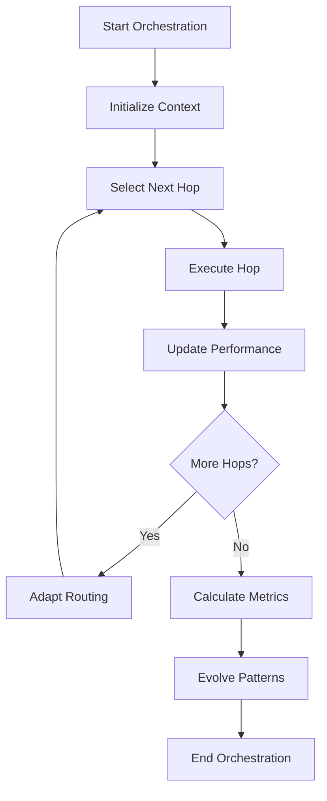
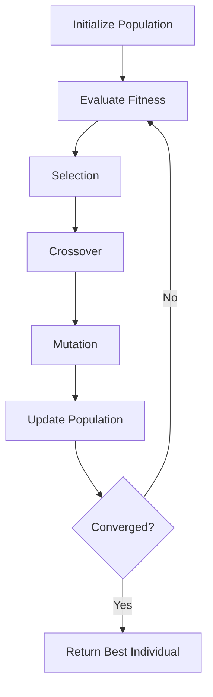
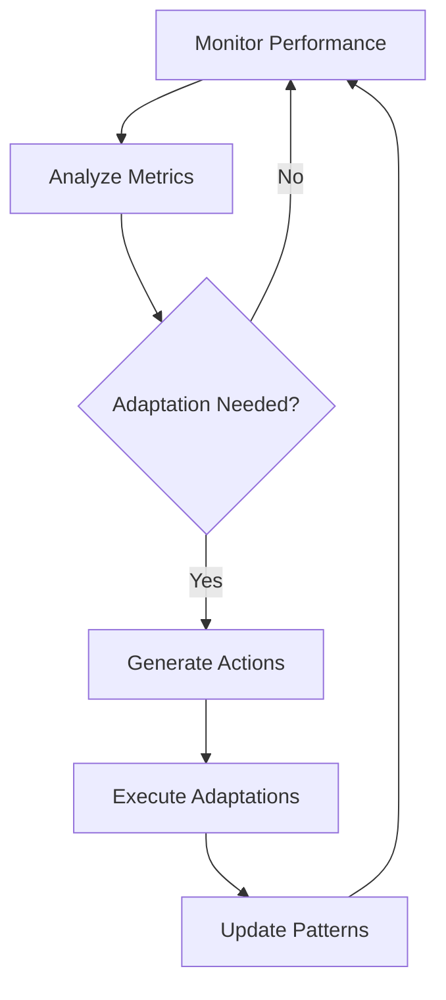

# Enhanced Orchestration System

## Overview

The Enhanced Orchestration System represents a significant advancement in AI orchestration capabilities, integrating multi-hop reasoning with evolutionary algorithms to create a self-improving, adaptive orchestration platform. This system builds upon the existing orchestration infrastructure while adding sophisticated intelligence and optimization capabilities.

## Key Features

### 🔄 Multi-Hop Orchestration

- **Adaptive Routing**: Intelligent hop selection based on context and performance
- **Dynamic Sequencing**: Flexible orchestration patterns that adapt to changing conditions
- **Quality Monitoring**: Real-time quality assessment and feedback loops
- **Performance Optimization**: Continuous optimization of orchestration patterns

### 🧬 Evolutionary Algorithms

- **Genetic Optimization**: Population-based optimization of orchestration patterns
- **Adaptive Learning**: Self-improving algorithms that learn from experience
- **Diversity Maintenance**: Ensures exploration of diverse solution spaces
- **Convergence Detection**: Intelligent stopping criteria for optimization

### 🎯 Enhanced Intelligence

- **Context-Aware Decision Making**: Decisions based on comprehensive context analysis
- **Performance-Based Adaptation**: Real-time adaptation based on performance metrics
- **Pattern Evolution**: Continuous evolution of orchestration patterns
- **Resource Optimization**: Intelligent resource allocation and utilization

## Architecture

### Core Components

#### 1. Multi-Hop Orchestrator (`multi_hop_orchestration.rs`)

```rust
pub struct MultiHopOrchestrator {
    config: MultiHopConfig,
    hop_registry: Arc<RwLock<HashMap<String, Box<dyn HopExecutor + Send + Sync>>>>,
    performance_tracker: Arc<RwLock<PerformanceTracker>>,
    evolutionary_optimizer: Arc<RwLock<EvolutionaryOptimizer>>,
    adaptive_router: Arc<RwLock<AdaptiveRouter>>,
}
```

**Key Capabilities:**

- Executes complex multi-hop orchestration workflows
- Tracks performance metrics across hops
- Adapts routing based on historical performance
- Integrates with evolutionary optimization

#### 2. Evolutionary Engine (`evolutionary_algorithms.rs`)

```rust
pub struct EvolutionaryEngine {
    config: EvolutionaryConfig,
    population: Arc<RwLock<Vec<Individual>>>,
    fitness_evaluator: Arc<dyn FitnessEvaluator + Send + Sync>,
    mutation_operator: Arc<dyn MutationOperator + Send + Sync>,
    crossover_operator: Arc<dyn CrossoverOperator + Send + Sync>,
    selection_operator: Arc<dyn SelectionOperator + Send + Sync>,
    diversity_maintainer: Arc<dyn DiversityMaintainer + Send + Sync>,
    convergence_detector: Arc<dyn ConvergenceDetector + Send + Sync>,
}
```

**Key Capabilities:**

- Population-based optimization of orchestration patterns
- Multiple mutation and crossover strategies
- Diversity maintenance and convergence detection
- Fitness evaluation based on performance metrics

#### 3. Enhanced Orchestration Engine (`enhanced_orchestration.rs`)

```rust
pub struct EnhancedOrchestrationEngine {
    config: EnhancedOrchestrationConfig,
    multi_hop_orchestrator: Arc<MultiHopOrchestrator>,
    evolutionary_engine: Arc<EvolutionaryEngine>,
    performance_monitor: Arc<RwLock<PerformanceMonitor>>,
    adaptation_manager: Arc<RwLock<AdaptationManager>>,
    pattern_library: Arc<RwLock<PatternLibrary>>,
}
```

**Key Capabilities:**

- Integrates multi-hop orchestration with evolutionary optimization
- Monitors performance and triggers adaptations
- Maintains a library of evolved orchestration patterns
- Provides comprehensive orchestration intelligence

## How It Works

### 1. Multi-Hop Execution Flow



### 2. Evolutionary Optimization Process



### 3. Adaptation Loop



## Configuration

### Multi-Hop Configuration

```rust
pub struct MultiHopConfig {
    pub max_hops: usize,                    // Maximum hops per orchestration
    pub hop_timeout: Duration,               // Timeout per hop
    pub total_timeout: Duration,             // Total orchestration timeout
    pub adaptive_routing: bool,              // Enable adaptive routing
    pub evolutionary_optimization: bool,    // Enable evolutionary optimization
    pub learning_rate: f64,                 // Learning rate for adaptation
    pub exploration_factor: f64,            // Exploration vs exploitation balance
}
```

### Evolutionary Configuration

```rust
pub struct EvolutionaryConfig {
    pub population_size: usize,             // Population size
    pub max_generations: usize,             // Maximum generations
    pub mutation_rate: f64,                 // Mutation rate (0.0-1.0)
    pub crossover_rate: f64,                // Crossover rate (0.0-1.0)
    pub selection_pressure: f64,            // Selection pressure
    pub elitism_rate: f64,                  // Elitism rate
    pub diversity_threshold: f64,           // Diversity threshold
    pub convergence_threshold: f64,         // Convergence threshold
}
```

## Usage Examples

### Basic Orchestration

```rust
use ai_orchestration_platform::enhanced_orchestration::{
    EnhancedOrchestrationEngine, EnhancedOrchestrationConfig,
    OrchestrationContext
};

#[tokio::main]
async fn main() -> Result<(), Box<dyn std::error::Error>> {
    // Create configuration
    let config = EnhancedOrchestrationConfig::default();

    // Create engine
    let engine = EnhancedOrchestrationEngine::new(config).await?;

    // Create initial context
    let context = OrchestrationContext {
        current_hop: 0,
        total_hops: 0,
        start_time: Instant::now(),
        results: Vec::new(),
        context_data: HashMap::new(),
        metrics: Default::default(),
    };

    // Define target goals
    let target_goals = vec![
        "data_processing".to_string(),
        "analysis".to_string(),
        "reporting".to_string(),
    ];

    // Execute orchestration
    let result = engine.execute_orchestration(context, target_goals).await?;

    println!("Orchestration completed with success: {}", result.success);
    println!("Quality score: {}", result.metrics.quality_score);

    Ok(())
}
```

### Custom Hop Executor

```rust
use ai_orchestration_platform::multi_hop_orchestration::{
    HopExecutor, HopResult, HopMetadata, OrchestrationContext
};

pub struct DataProcessingHop {
    metadata: HopMetadata,
}

#[async_trait::async_trait]
impl HopExecutor for DataProcessingHop {
    async fn execute(&self, context: &OrchestrationContext) -> Result<HopResult> {
        // Implement data processing logic
        let start_time = Instant::now();

        // Simulate data processing
        tokio::time::sleep(Duration::from_millis(100)).await;

        Ok(HopResult {
            hop_id: self.metadata.id.clone(),
            status: HopStatus::Success,
            data: serde_json::json!({"processed": true}),
            execution_time: start_time.elapsed(),
            quality_score: 0.95,
            next_hops: vec!["analysis".to_string()],
            metadata: HashMap::new(),
        })
    }

    fn get_metadata(&self) -> HopMetadata {
        self.metadata.clone()
    }

    fn is_applicable(&self, context: &OrchestrationContext) -> bool {
        // Check if data processing is applicable
        true
    }
}
```

## Performance Metrics

### Orchestration Metrics

- **Total Time**: Complete orchestration execution time
- **Average Hop Time**: Average time per hop
- **Success Rate**: Percentage of successful hops
- **Quality Score**: Overall quality assessment
- **Resource Utilization**: Resource usage efficiency
- **Adaptation Score**: Adaptation effectiveness

### Evolutionary Metrics

- **Fitness Variance**: Population diversity measure
- **Best Fitness**: Best individual fitness
- **Average Fitness**: Population average fitness
- **Diversity**: Population diversity measure
- **Stagnation Generations**: Generations without improvement

## Integration with Existing System

The Enhanced Orchestration System integrates seamlessly with the existing Universal AI Tools infrastructure:

### 1. **Agent Orchestrator Integration**

- Extends existing workflow orchestration with multi-hop capabilities
- Adds evolutionary optimization to agent coordination
- Enhances decision-making with adaptive routing

### 2. **LLM Router Integration**

- Provides intelligent routing based on performance metrics
- Enables adaptive model selection
- Optimizes routing patterns through evolution

### 3. **Monitoring Integration**

- Extends existing monitoring with orchestration-specific metrics
- Provides real-time performance tracking
- Enables adaptive monitoring strategies

### 4. **Testing Framework Integration**

- Enhances testing with evolutionary test generation
- Provides adaptive testing strategies
- Enables performance-based test optimization

## Benefits

### 🚀 **Performance Improvements**

- **Adaptive Optimization**: Continuous improvement of orchestration patterns
- **Intelligent Routing**: Context-aware hop selection
- **Resource Efficiency**: Optimized resource utilization
- **Quality Enhancement**: Improved success rates and quality scores

### 🧠 **Intelligence Enhancements**

- **Self-Learning**: System learns from experience
- **Pattern Evolution**: Continuous evolution of orchestration patterns
- **Adaptive Behavior**: Real-time adaptation to changing conditions
- **Context Awareness**: Comprehensive context analysis

### 🔧 **Operational Benefits**

- **Reduced Manual Intervention**: Automated optimization and adaptation
- **Improved Reliability**: Robust orchestration with fallback mechanisms
- **Scalability**: Efficient handling of complex orchestration scenarios
- **Maintainability**: Self-improving system reduces maintenance overhead

## Future Enhancements

### Planned Features

1. **Advanced Learning Algorithms**: Integration of reinforcement learning
2. **Distributed Evolution**: Multi-node evolutionary optimization
3. **Real-time Adaptation**: Sub-second adaptation capabilities
4. **Predictive Optimization**: Proactive optimization based on predictions
5. **Cross-Domain Learning**: Learning across different orchestration domains

### Research Integration

- **Latest AI Research**: Integration of cutting-edge AI research
- **Performance Optimization**: Advanced optimization techniques
- **Adaptive Systems**: Self-adaptive system capabilities
- **Evolutionary Computation**: Advanced evolutionary algorithms

## Conclusion

The Enhanced Orchestration System represents a significant leap forward in AI orchestration capabilities. By combining multi-hop reasoning with evolutionary algorithms, it creates a self-improving, adaptive orchestration platform that can handle complex scenarios while continuously optimizing its performance.

This system provides the foundation for next-generation AI orchestration, enabling:

- **Intelligent Automation**: Sophisticated automation with human-like reasoning
- **Continuous Improvement**: Self-improving systems that get better over time
- **Adaptive Intelligence**: Systems that adapt to changing conditions
- **Scalable Performance**: Efficient handling of complex orchestration scenarios

The integration with existing Universal AI Tools infrastructure ensures seamless adoption while providing significant enhancements to orchestration capabilities.
