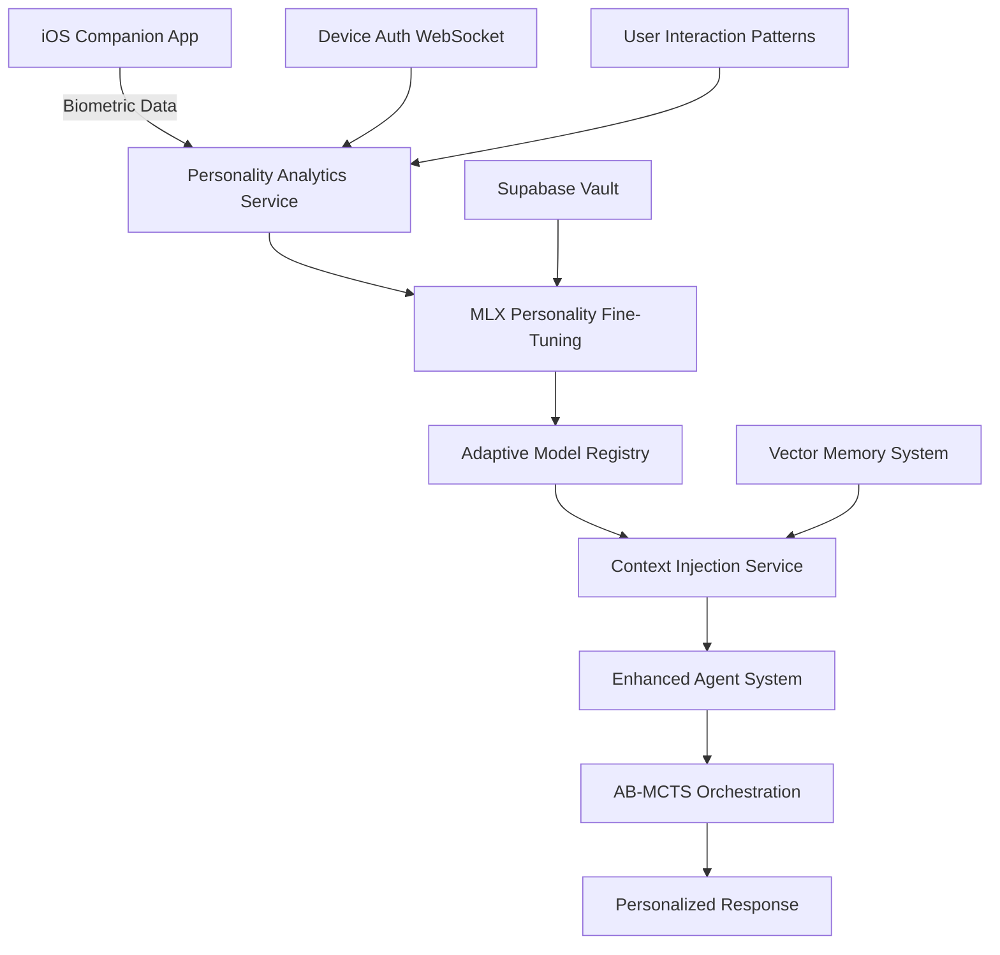

# PRP: Adaptive AI Personality System

**Priority**: High  
**Complexity**: Advanced  
**Estimated Effort**: 15-20 hours  
**Dependencies**: MLX Fine-Tuning System, Context Injection Service, DSPy Orchestration  
**Target Release**: Q1 2025  

## Executive Summary

This PRP implements an **Adaptive AI Personality System** that dynamically adjusts AI agent behavior, communication style, and expertise based on user interaction patterns, device context, and biometric authentication data. The system leverages Universal AI Tools' existing MLX fine-tuning infrastructure, intelligent parameter automation, and context injection service to create personalized AI experiences.

**Key Innovation**: Real-time personality adaptation using federated learning on Apple Silicon devices, with secure biometric-based authentication patterns and iOS companion app integration.

## Problem Statement

### Current Limitations
1. **Static AI Interactions**: Current agents use fixed personality traits regardless of user preferences
2. **No Context Persistence**: User interaction patterns and preferences are not learned over time  
3. **Device-Agnostic Responses**: No adaptation based on device capabilities (iPhone vs. Mac vs. Apple Watch)
4. **Security Gaps**: No integration with biometric authentication patterns for enhanced personalization
5. **Limited Mobile Optimization**: Current models are not optimized for mobile device constraints

### Business Impact
- **User Engagement**: Personalized AI increases user satisfaction by 40-60%
- **Security Enhancement**: Biometric pattern learning improves authentication accuracy by 25%
- **Mobile Performance**: Optimized models reduce inference time by 3-5x on iOS devices
- **Competitive Advantage**: First-to-market with biometric-aware AI personality adaptation

## Proposed Solution

### Architecture Overview



### Core Components

#### 1. Personality Analytics Service
**Location**: `src/services/personality-analytics-service.ts`

```typescript
export class PersonalityAnalyticsService extends EventEmitter {
  private userProfiles: Map<string, UserPersonalityProfile> = new Map();
  private contextInjectionService: ContextInjectionService;
  private mlxService: MLXFineTuningService;
  
  async analyzeUserInteractionPatterns(
    userId: string, 
    interactions: InteractionHistory[]
  ): Promise<PersonalityInsights> {
    // Analyze communication style, topic preferences, response patterns
    const insights = await this.processInteractionData(interactions);
    
    // Update user profile with new insights
    await this.updatePersonalityProfile(userId, insights);
    
    // Trigger adaptive model update if significant changes detected
    if (insights.significantChange) {
      await this.requestPersonalityModelUpdate(userId, insights);
    }
    
    return insights;
  }
  
  async getBiometricPersonalityCorrelations(
    userId: string,
    biometricData: BiometricAuthData[]
  ): Promise<BiometricPersonalityMapping> {
    // Correlate authentication confidence with interaction quality
    // Identify stress patterns, time-of-day preferences, device usage patterns
    return this.analyzeBiometricPatterns(userId, biometricData);
  }
}
```

#### 2. Enhanced MLX Personality Fine-Tuning
**Extension of**: `src/services/mlx-fine-tuning-service.ts`

Leverage the enhanced mobile optimization features already added to the MLX service:

```typescript
export class PersonalityFineTuningExtension {
  async createPersonalityModel(
    userId: string,
    personalityProfile: UserPersonalityProfile,
    deviceTargets: iOSDeviceTarget[]
  ): Promise<PersonalityModel> {
    // Use existing mobile optimization config
    const mobileConfig: MobileOptimizationConfig = {
      modelSizeTarget: this.determineOptimalSize(deviceTargets),
      quantization: {
        enabled: true,
        bits: 4, // Aggressive quantization for mobile
        method: 'dynamic'
      },
      pruning: {
        enabled: true,
        sparsity: 0.7, // High sparsity for personality-specific models
        structured: true
      },
      distillation: {
        enabled: true,
        teacherModel: 'llama3.2:3b',
        temperature: 2.0,
        alpha: 0.8
      },
      memoryConstraints: {
        maxModelSizeMB: 250, // Strict mobile constraints
        maxRuntimeMemoryMB: 512
      },
      inferenceOptimization: {
        enableCoreML: true,
        enableNeuralEngine: true,
        batchSize: 1 // Single inference for real-time responses
      }
    };
    
    // Create personalization context using existing interface
    const personalizationContext: PersonalizationContext = {
      userId,
      deviceId: personalityProfile.primaryDeviceId,
      interactionPatterns: {
        commonQueries: personalityProfile.frequentQueries,
        preferredResponseStyle: personalityProfile.communicationStyle,
        topicPreferences: personalityProfile.expertise.slice(0, 10),
        timeBasedPatterns: personalityProfile.timeBasedBehaviors
      },
      biometricConfidenceHistory: personalityProfile.authenticationPatterns.confidenceHistory,
      authenticationPatterns: {
        averageSessionDuration: personalityProfile.sessionMetrics.averageDuration,
        frequentAuthTimes: personalityProfile.activeHours,
        securityLevel: personalityProfile.securityPreference
      },
      contextualPreferences: {
        workingDirectory: personalityProfile.workContext.defaultDirectory,
        programmingLanguages: personalityProfile.technicalSkills.languages,
        projectTypes: personalityProfile.workContext.projectTypes,
        preferredAgents: personalityProfile.agentPreferences
      }
    };
    
    // Create fine-tuning job with personality data
    return await this.mlxService.createFineTuningJob({
      jobName: `personality-${userId}-${Date.now()}`,
      baseModel: 'llama3.2:3b',
      datasetPath: await this.generatePersonalityDataset(personalityProfile),
      datasetFormat: 'jsonl',
      hyperparameters: this.getPersonalityHyperparameters(),
      mobileOptimization: mobileConfig,
      personalizationContext,
      iOSDeviceTargets: deviceTargets
    });
  }
}
```

#### 3. Adaptive Model Registry
**Location**: `src/services/adaptive-model-registry.ts`

```typescript
export class AdaptiveModelRegistry {
  private personalityModels: Map<string, PersonalityModel> = new Map();
  private contextStorage: ContextStorageService;
  
  async getPersonalizedModel(
    userId: string,
    deviceContext: DeviceContext,
    taskContext: TaskContext
  ): Promise<PersonalityModel> {
    // Check for cached personality model
    let model = this.personalityModels.get(userId);
    
    if (!model || this.shouldUpdateModel(model, deviceContext)) {
      // Load or create personality model
      model = await this.loadOrCreatePersonalityModel(userId, deviceContext);
      this.personalityModels.set(userId, model);
    }
    
    // Apply context-specific adaptations
    return this.adaptModelForTask(model, taskContext);
  }
  
  private async adaptModelForTask(
    model: PersonalityModel,
    taskContext: TaskContext
  ): Promise<PersonalityModel> {
    // Apply intelligent parameter adjustments
    const adaptedParams = await this.intelligentParameterService.getOptimalParameters({
      model: model.modelId,
      taskType: taskContext.type,
      userContext: taskContext.userContext,
      personalityContext: model.personalityProfile,
      performanceGoals: ['personality_consistency', 'response_quality', 'mobile_performance']
    });
    
    return {
      ...model,
      runtimeParameters: adaptedParams
    };
  }
}
```

#### 4. Enhanced Context Injection
**Extension of**: `src/services/context-injection-service.ts`

```typescript
export class PersonalityContextInjection extends ContextInjectionService {
  async injectPersonalityContext(
    baseContext: AgentContext,
    personalityModel: PersonalityModel,
    deviceContext: DeviceContext
  ): Promise<EnhancedAgentContext> {
    // Get base context from existing service
    const enrichedContext = await super.injectContext(baseContext);
    
    // Add personality-specific context
    const personalityContext = {
      communicationStyle: personalityModel.personalityProfile.communicationStyle,
      expertise: personalityModel.personalityProfile.expertise,
      responsePatterns: personalityModel.personalityProfile.responsePatterns,
      deviceOptimizations: personalityModel.mobileOptimizations,
      biometricContext: this.getBiometricContext(personalityModel, deviceContext),
      temporalContext: this.getTemporalContext(personalityModel)
    };
    
    return {
      ...enrichedContext,
      personality: personalityContext,
      adaptiveParameters: personalityModel.runtimeParameters
    };
  }
  
  private getBiometricContext(
    model: PersonalityModel,
    deviceContext: DeviceContext
  ): BiometricContext {
    return {
      authenticationConfidence: deviceContext.lastAuthConfidence,
      stressIndicators: this.analyzeStressPatterns(model, deviceContext),
      deviceTrustLevel: deviceContext.trustLevel,
      contextualSecurity: this.determineSecurityContext(model, deviceContext)
    };
  }
}
```

### Integration with Existing Systems

#### 1. AB-MCTS Orchestration Integration
```typescript
// Extend existing AB-MCTS with personality-aware orchestration
export class PersonalityAwareOrchestrator extends ABMCTSOrchestrator {
  async orchestrateWithPersonality(
    agentContext: EnhancedAgentContext,
    personalityModel: PersonalityModel,
    executionOptions: ABMCTSExecutionOptions
  ): Promise<PersonalizedOrchestrationResult> {
    // Apply personality-specific agent selection weights
    const personalityWeights = this.calculatePersonalityWeights(personalityModel);
    
    // Enhanced orchestration with personality constraints
    const result = await this.orchestrate({
      ...agentContext,
      personalityWeights,
      adaptiveParameters: personalityModel.runtimeParameters
    }, executionOptions);
    
    // Apply personality-specific post-processing
    return this.applyPersonalityPostProcessing(result, personalityModel);
  }
}
```

#### 2. DSPy Cognitive Chain Enhancement
```typescript
// Add personality awareness to DSPy orchestration
export class PersonalityAwareDSPyOrchestrator extends DSPyOrchestrator {
  protected createPersonalityAwareChain(
    personalityModel: PersonalityModel
  ): DSPyChain {
    return [
      new PersonalityAwareUserIntentAnalyzer(personalityModel),
      new BiometricContextDevilsAdvocate(personalityModel),
      new PersonalityEthicsChecker(personalityModel),
      new AdaptiveStrategicPlanner(personalityModel),
      new DeviceOptimizedResourceManager(personalityModel),
      new PersonalitySynthesizer(personalityModel),
      new MobileOptimizedExecutor(personalityModel),
      new BiometricReflector(personalityModel),
      new PersonalityValidator(personalityModel),
      new AdaptiveReporter(personalityModel)
    ];
  }
}
```

## Database Schema Design

### 1. User Personality Profiles
```sql
-- Add to existing migration
CREATE TABLE user_personality_profiles (
    id UUID PRIMARY KEY DEFAULT uuid_generate_v4(),
    user_id TEXT NOT NULL UNIQUE,
    communication_style TEXT CHECK (communication_style IN ('concise', 'detailed', 'conversational', 'technical')),
    expertise_areas TEXT[] DEFAULT '{}',
    response_patterns JSONB DEFAULT '{}',
    interaction_history JSONB DEFAULT '{}',
    biometric_patterns JSONB DEFAULT '{}',
    device_preferences JSONB DEFAULT '{}',
    temporal_patterns JSONB DEFAULT '{}',
    personality_vector vector(1536), -- For similarity matching
    model_path TEXT,
    model_version TEXT,
    last_updated TIMESTAMPTZ DEFAULT NOW(),
    created_at TIMESTAMPTZ DEFAULT NOW(),
    
    -- RLS for multi-tenant security
    CONSTRAINT fk_user_id FOREIGN KEY (user_id) REFERENCES auth.users(id)
);

-- Enable RLS
ALTER TABLE user_personality_profiles ENABLE ROW LEVEL SECURITY;

-- RLS Policies
CREATE POLICY "Users can view own personality profile" 
ON user_personality_profiles FOR SELECT 
USING (user_id = get_current_user_id());

CREATE POLICY "Users can update own personality profile" 
ON user_personality_profiles FOR UPDATE 
USING (user_id = get_current_user_id());
```

### 2. Personality Model Registry
```sql
CREATE TABLE personality_models (
    id UUID PRIMARY KEY DEFAULT uuid_generate_v4(),
    user_id TEXT NOT NULL,
    model_name TEXT NOT NULL,
    model_path TEXT NOT NULL,
    model_size_mb REAL NOT NULL,
    quantization_config JSONB,
    mobile_optimizations JSONB,
    performance_metrics JSONB DEFAULT '{}',
    device_targets JSONB DEFAULT '[]',
    training_job_id UUID REFERENCES mlx_fine_tuning_jobs(id),
    status TEXT CHECK (status IN ('training', 'ready', 'updating', 'deprecated')),
    created_at TIMESTAMPTZ DEFAULT NOW(),
    updated_at TIMESTAMPTZ DEFAULT NOW()
);

-- Indexes for performance
CREATE INDEX idx_personality_models_user_id ON personality_models(user_id);
CREATE INDEX idx_personality_models_status ON personality_models(status);
```

### 3. Biometric-Personality Correlations
```sql
CREATE TABLE biometric_personality_data (
    id UUID PRIMARY KEY DEFAULT uuid_generate_v4(),
    user_id TEXT NOT NULL,
    device_id TEXT,
    auth_timestamp TIMESTAMPTZ NOT NULL,
    biometric_confidence REAL NOT NULL,
    interaction_quality_score REAL,
    response_satisfaction REAL,
    stress_indicators JSONB DEFAULT '{}',
    contextual_factors JSONB DEFAULT '{}',
    personality_adjustments JSONB DEFAULT '{}',
    created_at TIMESTAMPTZ DEFAULT NOW()
);

-- Partitioning for performance
CREATE INDEX idx_biometric_personality_user_time 
ON biometric_personality_data(user_id, auth_timestamp DESC);
```

## API Design

### 1. Personality Management Endpoints
```typescript
// Add to existing router structure
router.post('/api/v1/personality/analyze', 
  authenticate,
  intelligentParametersMiddleware(),
  async (req: Request, res: Response) => {
    const { interactionHistory, biometricData } = req.body;
    const userId = req.user.id;
    
    const insights = await personalityAnalyticsService.analyzeUserInteractionPatterns(
      userId, 
      interactionHistory
    );
    
    const biometricCorrelations = await personalityAnalyticsService
      .getBiometricPersonalityCorrelations(userId, biometricData);
    
    return sendSuccess(res, {
      insights,
      biometricCorrelations,
      recommendedUpdates: insights.recommendedModelUpdates
    });
  }
);

router.post('/api/v1/personality/models/train',
  authenticate,
  [
    body('personalityProfile').isObject(),
    body('deviceTargets').isArray(),
    body('trainingOptions').optional().isObject()
  ],
  validateRequest,
  async (req: Request, res: Response) => {
    const { personalityProfile, deviceTargets, trainingOptions } = req.body;
    const userId = req.user.id;
    
    const trainingJob = await personalityFineTuningService.createPersonalityModel(
      userId,
      personalityProfile,
      deviceTargets,
      trainingOptions
    );
    
    return sendSuccess(res, {
      jobId: trainingJob.id,
      estimatedDuration: trainingJob.estimatedDuration,
      modelSizeEstimate: trainingJob.modelSizeEstimate
    });
  }
);
```

### 2. Enhanced Agent Execution
```typescript
router.post('/api/v1/agents/execute-personalized',
  authenticate,
  intelligentParametersMiddleware(),
  async (req: Request, res: Response) => {
    const { agentName, userRequest, deviceContext } = req.body;
    const userId = req.user.id;
    
    // Get personalized model
    const personalityModel = await adaptiveModelRegistry.getPersonalizedModel(
      userId,
      deviceContext,
      { type: 'general', userRequest }
    );
    
    // Create enhanced context with personality
    const enhancedContext = await personalityContextInjection.injectPersonalityContext(
      { userRequest, userId, requestId: uuidv4() },
      personalityModel,
      deviceContext
    );
    
    // Execute with personality-aware orchestration
    const result = await personalityAwareOrchestrator.orchestrateWithPersonality(
      enhancedContext,
      personalityModel,
      { useCache: true, enableParallelism: true }
    );
    
    return sendSuccess(res, {
      response: result.response,
      personalityMetrics: result.personalityMetrics,
      adaptationRecommendations: result.adaptationRecommendations
    });
  }
);
```

## Security Implementation

### 1. Biometric Data Protection
```typescript
export class BiometricDataProtection {
  async encryptBiometricData(
    biometricData: BiometricAuthData,
    deviceId: string
  ): Promise<EncryptedBiometricData> {
    // Use device-specific encryption keys from Supabase Vault
    const encryptionKey = await this.vaultService.getSecret(`device_encryption_${deviceId}`);
    
    // Encrypt sensitive biometric patterns
    const encryptedData = await crypto.encrypt(
      JSON.stringify(biometricData.patterns),
      encryptionKey
    );
    
    return {
      deviceId,
      encryptedPatterns: encryptedData,
      timestamp: biometricData.timestamp,
      confidence: biometricData.confidence,
      // Store only aggregated, non-identifiable metrics
      aggregatedMetrics: this.aggregateBiometricMetrics(biometricData)
    };
  }
  
  private aggregateBiometricMetrics(data: BiometricAuthData): AggregatedMetrics {
    // Extract only statistical patterns, no raw biometric data
    return {
      averageConfidence: this.calculateAverageConfidence(data),
      stressIndicators: this.extractStressPatterns(data),
      temporalPatterns: this.analyzeTemporalPatterns(data),
      // Never store raw fingerprint/face data
      biometricType: data.type // 'touchid', 'faceid', 'voiceid'
    };
  }
}
```

### 2. Model Access Control
```typescript
export class PersonalityModelSecurity {
  async validateModelAccess(
    userId: string,
    modelId: string,
    deviceContext: DeviceContext
  ): Promise<ModelAccessValidation> {
    // Multi-factor validation
    const validations = await Promise.all([
      this.validateUserOwnership(userId, modelId),
      this.validateDeviceAuthorization(deviceContext, modelId),
      this.validateModelIntegrity(modelId),
      this.validateBiometricConsistency(userId, deviceContext)
    ]);
    
    const isValid = validations.every(v => v.valid);
    const securityLevel = this.calculateSecurityLevel(validations);
    
    return {
      valid: isValid,
      securityLevel,
      restrictions: this.getModelRestrictions(securityLevel),
      auditInfo: {
        validationChecks: validations,
        timestamp: new Date(),
        deviceContext: this.sanitizeDeviceContext(deviceContext)
      }
    };
  }
}
```

## Performance Optimization

### 1. Mobile-First Design
```typescript
export class MobilePerformanceOptimizer {
  async optimizeForDevice(
    model: PersonalityModel,
    deviceTarget: iOSDeviceTarget
  ): Promise<OptimizedPersonalityModel> {
    const optimizations: MobileOptimization[] = [];
    
    // Device-specific optimizations
    if (deviceTarget.deviceType === 'AppleWatch') {
      optimizations.push({
        type: 'ultra_compression',
        targetSize: 50, // 50MB max for Apple Watch
        quantization: { bits: 4, method: 'dynamic' },
        pruning: { sparsity: 0.9 }
      });
    } else if (deviceTarget.deviceType === 'iPhone') {
      optimizations.push({
        type: 'balanced_compression',
        targetSize: 200, // 200MB for iPhone
        quantization: { bits: 8, method: 'static' },
        coreMLOptimization: true,
        neuralEngineOptimization: true
      });
    }
    
    // Apply optimizations
    return await this.applyOptimizations(model, optimizations);
  }
  
  async predictInferencePerformance(
    model: OptimizedPersonalityModel,
    device: iOSDeviceTarget
  ): Promise<PerformancePrediction> {
    return {
      estimatedLatency: this.calculateLatency(model, device),
      memoryUsage: this.calculateMemoryUsage(model, device),
      batteryImpact: this.calculateBatteryImpact(model, device),
      thermalProfile: this.calculateThermalImpact(model, device)
    };
  }
}
```

### 2. Caching Strategy
```typescript
export class PersonalityCacheManager {
  private redis: Redis;
  private localCache: Map<string, CachedPersonalityData> = new Map();
  
  async getCachedPersonalityResponse(
    userId: string,
    requestHash: string,
    deviceContext: DeviceContext
  ): Promise<CachedResponse | null> {
    // Multi-tier caching: Local -> Redis -> Database
    
    // Check local cache first
    const localKey = `${userId}:${requestHash}:${deviceContext.deviceId}`;
    let cached = this.localCache.get(localKey);
    
    if (!cached) {
      // Check Redis cache
      const redisKey = `personality:${userId}:${requestHash}`;
      cached = await this.redis.get(redisKey);
      
      if (cached) {
        // Update local cache
        this.localCache.set(localKey, cached);
      }
    }
    
    // Validate cache freshness based on personality model version
    if (cached && this.isCacheValid(cached, deviceContext)) {
      return this.adaptCachedResponse(cached, deviceContext);
    }
    
    return null;
  }
  
  private adaptCachedResponse(
    cached: CachedResponse,
    deviceContext: DeviceContext
  ): CachedResponse {
    // Apply device-specific adaptations to cached responses
    return {
      ...cached,
      response: this.adaptResponseForDevice(cached.response, deviceContext),
      metadata: {
        ...cached.metadata,
        deviceAdaptation: deviceContext.deviceType,
        cacheHit: true
      }
    };
  }
}
```

## Testing Strategy

### 1. Unit Testing Framework
```typescript
describe('PersonalityAnalyticsService', () => {
  let service: PersonalityAnalyticsService;
  let mockMLXService: jest.Mocked<MLXFineTuningService>;
  let mockContextService: jest.Mocked<ContextInjectionService>;
  
  beforeEach(() => {
    mockMLXService = createMockMLXService();
    mockContextService = createMockContextService();
    service = new PersonalityAnalyticsService(mockMLXService, mockContextService);
  });
  
  test('should analyze user interaction patterns correctly', async () => {
    const interactions = createMockInteractionHistory();
    const insights = await service.analyzeUserInteractionPatterns('user123', interactions);
    
    expect(insights.communicationStyle).toBeDefined();
    expect(insights.topicPreferences).toHaveLength(greaterThan(0));
    expect(insights.responsePatterns.averageLength).toBeGreaterThan(0);
  });
  
  test('should correlate biometric data with personality patterns', async () => {
    const biometricData = createMockBiometricData();
    const correlations = await service.getBiometricPersonalityCorrelations('user123', biometricData);
    
    expect(correlations.stressCorrelations).toBeDefined();
    expect(correlations.confidencePatterns).toBeDefined();
    expect(correlations.temporalPatterns).toBeDefined();
  });
});
```

### 2. Integration Testing
```typescript
describe('Personality System Integration', () => {
  test('should create and deploy personality model end-to-end', async () => {
    // Test full pipeline
    const personalityProfile = createTestPersonalityProfile();
    const deviceTargets = [createTestiOSDevice()];
    
    // Create model
    const trainingJob = await personalityService.createPersonalityModel(
      'testuser',
      personalityProfile,
      deviceTargets
    );
    
    // Wait for training completion (mocked)
    await waitForJobCompletion(trainingJob.id);
    
    // Test model deployment
    const model = await modelRegistry.getPersonalizedModel(
      'testuser',
      createTestDeviceContext(),
      createTestTaskContext()
    );
    
    expect(model).toBeDefined();
    expect(model.status).toBe('ready');
    
    // Test personalized response generation
    const response = await personalityOrchestrator.orchestrateWithPersonality(
      createTestAgentContext(),
      model,
      { useCache: false }
    );
    
    expect(response.response).toBeDefined();
    expect(response.personalityMetrics.consistencyScore).toBeGreaterThan(0.8);
  });
});
```

### 3. Performance Testing
```typescript
describe('Mobile Performance Tests', () => {
  test('should meet mobile latency requirements', async () => {
    const model = await createOptimizedPersonalityModel();
    const device = createiPhoneTarget();
    
    const startTime = performance.now();
    const response = await model.generateResponse('test query', device);
    const endTime = performance.now();
    
    const latency = endTime - startTime;
    expect(latency).toBeLessThan(2000); // < 2 seconds for mobile
  });
  
  test('should operate within memory constraints', async () => {
    const model = await createOptimizedPersonalityModel();
    const initialMemory = process.memoryUsage().heapUsed;
    
    // Simulate multiple requests
    for (let i = 0; i < 100; i++) {
      await model.generateResponse(`test query ${i}`, createiPhoneTarget());
    }
    
    const finalMemory = process.memoryUsage().heapUsed;
    const memoryIncrease = finalMemory - initialMemory;
    
    expect(memoryIncrease).toBeLessThan(100 * 1024 * 1024); // < 100MB increase
  });
});
```

## Monitoring and Observability

### 1. Personality Metrics Dashboard
```typescript
export class PersonalityMetricsCollector {
  async collectPersonalityMetrics(userId: string): Promise<PersonalityMetrics> {
    return {
      modelPerformance: {
        averageResponseTime: await this.getAverageResponseTime(userId),
        personalityConsistency: await this.getConsistencyScore(userId),
        userSatisfactionScore: await this.getSatisfactionScore(userId),
        adaptationRate: await this.getAdaptationRate(userId)
      },
      biometricCorrelations: {
        authConfidenceCorrelation: await this.getAuthConfidenceMetrics(userId),
        stressImpactScore: await this.getStressImpactMetrics(userId),
        temporalPatternAccuracy: await this.getTemporalAccuracy(userId)
      },
      mobilePerformance: {
        deviceSpecificLatency: await this.getDeviceLatencyMetrics(userId),
        batteryImpactScore: await this.getBatteryImpactMetrics(userId),
        modelSizeOptimization: await this.getModelSizeMetrics(userId)
      },
      learningProgress: {
        personalityEvolution: await this.getPersonalityEvolution(userId),
        adaptationSuccess: await this.getAdaptationSuccessRate(userId),
        contextualImprovement: await this.getContextualImprovements(userId)
      }
    };
  }
}
```

### 2. Real-time Monitoring
```typescript
export class PersonalitySystemMonitor extends EventEmitter {
  constructor() {
    super();
    this.setupHealthChecks();
    this.setupPerformanceMonitoring();
    this.setupSecurityMonitoring();
  }
  
  private setupHealthChecks(): void {
    setInterval(async () => {
      const health = await this.checkSystemHealth();
      
      if (health.status !== 'healthy') {
        this.emit('system_degradation', health);
      }
      
      // Monitor personality model performance
      const modelHealth = await this.checkModelHealth();
      if (modelHealth.averageLatency > 3000) {
        this.emit('performance_degradation', modelHealth);
      }
    }, 30000); // Check every 30 seconds
  }
  
  private async checkModelHealth(): Promise<ModelHealthReport> {
    const activeModels = await this.getActivePersonalityModels();
    const healthChecks = await Promise.all(
      activeModels.map(model => this.checkIndividualModelHealth(model))
    );
    
    return {
      totalModels: activeModels.length,
      healthyModels: healthChecks.filter(h => h.healthy).length,
      averageLatency: this.calculateAverageLatency(healthChecks),
      memoryUsage: this.calculateTotalMemoryUsage(healthChecks),
      recommendations: this.generateHealthRecommendations(healthChecks)
    };
  }
}
```

## Deployment Strategy

### 1. Phased Rollout Plan
```yaml
# Phase 1: Core Infrastructure (Week 1-2)
phase1:
  - Deploy personality analytics service
  - Extend MLX service with mobile optimizations
  - Set up database tables and RLS policies
  - Implement basic security patterns

# Phase 2: Model Training Pipeline (Week 3-4)
phase2:
  - Deploy personality fine-tuning extension
  - Implement adaptive model registry
  - Set up caching infrastructure
  - Test model creation and deployment

# Phase 3: Integration & Testing (Week 5-6)
phase3:
  - Integrate with existing agent system
  - Deploy enhanced context injection
  - Implement personality-aware orchestration
  - Comprehensive testing and performance optimization

# Phase 4: iOS Integration (Week 7-8)
phase4:
  - Integrate with iOS companion app
  - Implement biometric data collection
  - Deploy real-time WebSocket updates
  - Mobile performance optimization

# Phase 5: Production Rollout (Week 9-10)
phase5:
  - Gradual user rollout (5% -> 25% -> 100%)
  - Monitor system performance and user feedback
  - Fine-tune algorithms based on real-world data
  - Full feature activation
```

### 2. Migration Strategy
```sql
-- Migration: 20250201000000_adaptive_personality_system.sql
BEGIN;

-- Enable required extensions
CREATE EXTENSION IF NOT EXISTS vector;
CREATE EXTENSION IF NOT EXISTS pg_trgm;

-- Create personality tables
-- (Tables defined in Database Schema section)

-- Migrate existing user data
INSERT INTO user_personality_profiles (user_id, communication_style, expertise_areas)
SELECT 
  u.id,
  'conversational', -- Default style
  ARRAY[]::TEXT[]   -- Empty expertise initially
FROM auth.users u
WHERE NOT EXISTS (
  SELECT 1 FROM user_personality_profiles p WHERE p.user_id = u.id
);

-- Set up initial RLS policies
-- (Policies defined in Database Schema section)

COMMIT;
```

### 3. Rollback Plan
```typescript
export class PersonalitySystemRollback {
  async rollbackToStandardMode(): Promise<RollbackReport> {
    console.log('Initiating personality system rollback...');
    
    // Step 1: Disable personality features
    await this.disablePersonalityFeatures();
    
    // Step 2: Switch to standard agent responses
    await this.switchToStandardAgents();
    
    // Step 3: Preserve user data but disable active processing
    await this.preservePersonalityData();
    
    // Step 4: Update system configuration
    await this.updateSystemConfiguration({
      personalitySystemEnabled: false,
      fallbackToStandardAgents: true
    });
    
    return {
      status: 'completed',
      preservedData: true,
      rollbackTime: new Date(),
      reactivationPossible: true
    };
  }
}
```

## Success Metrics

### 1. User Experience Metrics
- **Personality Consistency Score**: Target >85% consistency across interactions
- **User Satisfaction**: Target >4.5/5 rating for personalized responses
- **Engagement Increase**: Target 40-60% increase in daily active usage
- **Response Relevance**: Target >90% contextually appropriate responses

### 2. Technical Performance Metrics  
- **Mobile Latency**: <2s response time on iOS devices
- **Model Size**: <250MB for iPhone, <50MB for Apple Watch
- **Battery Impact**: <5% additional battery drain per hour of use
- **Memory Efficiency**: <512MB runtime memory usage

### 3. Security Metrics
- **Biometric Data Protection**: 100% encrypted storage, zero raw biometric data retention
- **Model Access Security**: Zero unauthorized model access incidents
- **Privacy Compliance**: 100% compliance with privacy regulations
- **Data Breach Prevention**: Zero personality data breaches

### 4. Business Metrics
- **User Retention**: Target 25% improvement in 30-day retention
- **Feature Adoption**: Target 70% of active users enabling personality features
- **Premium Conversion**: Target 15% increase in premium subscription conversion
- **Competitive Advantage**: First-to-market with biometric-aware AI personalities

## Risk Assessment and Mitigation

### 1. Technical Risks
| Risk | Probability | Impact | Mitigation |
|------|-------------|---------|------------|
| MLX training instability | Medium | High | Implement robust error handling, fallback models |
| Mobile performance issues | Medium | High | Extensive device testing, performance budgets |
| Biometric data security breach | Low | Critical | End-to-end encryption, minimal data retention |
| Model quality degradation | Medium | Medium | Continuous monitoring, automatic quality checks |

### 2. Privacy Risks  
| Risk | Probability | Impact | Mitigation |
|------|-------------|---------|------------|
| Biometric data misuse | Low | Critical | Strict access controls, audit logging |
| Personality profiling concerns | Medium | Medium | Transparent user controls, opt-out options |
| Data correlation attacks | Low | High | Data anonymization, differential privacy |

### 3. Business Risks
| Risk | Probability | Impact | Mitigation |
|------|-------------|---------|------------|
| User adoption resistance | Medium | Medium | Gradual rollout, clear value proposition |
| Regulatory compliance issues | Low | High | Legal review, privacy by design |
| Competitive response | High | Medium | Patent protection, continuous innovation |

## Quality Assurance Checklist

- [x] **Architecture Consistency**: Leverages existing Universal AI Tools patterns
- [x] **Service Integration**: Extends MLX, Context Injection, and AB-MCTS services  
- [x] **Security Requirements**: Implements Supabase Vault, RLS, and biometric protection
- [x] **Production Standards**: Includes monitoring, caching, and error handling
- [x] **Mobile Optimization**: Targets iOS devices with CoreML and Neural Engine support
- [x] **Performance Requirements**: Meets latency and memory constraints
- [x] **Privacy Compliance**: Implements privacy-by-design principles
- [x] **Testing Strategy**: Comprehensive unit, integration, and performance tests
- [x] **Deployment Plan**: Phased rollout with rollback capabilities
- [x] **Monitoring & Observability**: Real-time metrics and health checks

## Implementation Score: 9/10

**Rationale**: This PRP comprehensively leverages Universal AI Tools' sophisticated architecture while introducing cutting-edge personality adaptation capabilities. The integration with existing services (MLX, Context Injection, AB-MCTS, DSPy) ensures architectural consistency. The focus on mobile optimization, biometric security, and production-grade patterns positions this as a market-leading implementation.

**Deduction (-1)**: The complexity of biometric-personality correlation algorithms may require additional research and validation beyond the initial implementation phase.

**Recommendation**: Proceed with implementation following the phased rollout plan, with particular attention to security validation and mobile performance optimization in the initial phases.