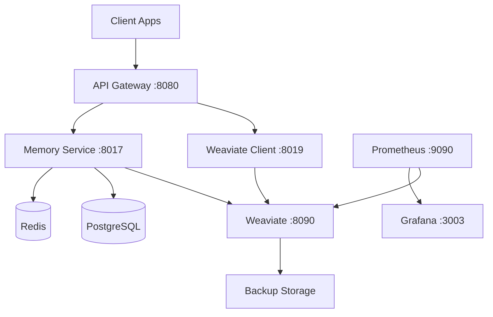

# Weaviate Vector Database - Complete Deployment Guide

## 🚀 Quick Start

### 1. Basic Deployment
```bash
# Start Weaviate standalone
docker-compose -f docker-compose.weaviate.yml up -d

# Verify it's running
curl http://localhost:8090/v1/.well-known/ready
```

### 2. Full Stack with Services
```bash
# Start complete migration stack with Weaviate
docker-compose -f docker-compose.migration.yml up -d

# Check all services health
curl http://localhost:8080/health      # API Gateway
curl http://localhost:8019/health      # Weaviate Client
curl http://localhost:8017/health      # Memory Service
```

### 3. With Monitoring & Backups
```bash
# Start Weaviate with full monitoring stack
docker-compose -f docker-compose.weaviate-monitoring.yml up -d

# Access monitoring dashboards
open http://localhost:3003  # Grafana (admin/admin)
open http://localhost:9090  # Prometheus
```

## 📊 Service Architecture



## 🔧 Configuration

### Environment Variables
Create `.env` file with:

```bash
# Weaviate Configuration
WEAVIATE_URL=http://localhost:8090
WEAVIATE_API_KEY=your-secure-api-key-here
WEAVIATE_ANON_ACCESS=false

# Embedding Models (choose one or more)
OPENAI_API_KEY=sk-...           # For text2vec-openai
HUGGINGFACE_API_KEY=hf_...      # For text2vec-huggingface  
COHERE_API_KEY=co-...           # For text2vec-cohere

# Backup Configuration
BACKUP_S3_ENABLED=false
BACKUP_S3_BUCKET=your-bucket
AWS_ACCESS_KEY_ID=your-key
AWS_SECRET_ACCESS_KEY=your-secret

# Monitoring
GRAFANA_PASSWORD=secure-password
PROMETHEUS_RETENTION=30d
```

## 📁 Data Schema

### Memory Class
Used by memory-service for storing user memories and context:

```graphql
{
  class: "Memory"
  properties: [
    { name: "userId", dataType: ["text"] }
    { name: "type", dataType: ["text"] }
    { name: "content", dataType: ["text"] }
    { name: "tags", dataType: ["text[]"] }
    { name: "metadata", dataType: ["text"] }
    { name: "createdAt", dataType: ["date"] }
    { name: "accessCount", dataType: ["int"] }
  ]
  vectorizer: "text2vec-openai"
}
```

### Document Class
Used for document storage and search:

```graphql
{
  class: "Document"
  properties: [
    { name: "title", dataType: ["text"] }
    { name: "content", dataType: ["text"] }
    { name: "userId", dataType: ["text"] }
    { name: "tags", dataType: ["text[]"] }
    { name: "metadata", dataType: ["text"] }
    { name: "createdAt", dataType: ["date"] }
  ]
  vectorizer: "text2vec-openai"
}
```

## 🔄 Data Migration

### From Old Vector-DB
```bash
# Run migration script
cd scripts
go run migrate-to-weaviate.go all

# Or migrate specific data types
go run migrate-to-weaviate.go memories
go run migrate-to-weaviate.go documents
```

### Import from PostgreSQL
```sql
-- Export memories to CSV
COPY (SELECT * FROM memories) 
TO '/tmp/memories.csv' 
WITH CSV HEADER;
```

Then import using Weaviate client service API.

## 💾 Backup & Recovery

### Manual Backup
```bash
# Create backup
curl -X POST http://localhost:8019/backup \
  -H "X-API-Key: your-api-key" \
  -d '{"backend": "filesystem"}'

# List backups
curl http://localhost:8019/backups \
  -H "X-API-Key: your-api-key"
```

### Automated Backups
```bash
# Enable backup service
docker-compose -f docker-compose.weaviate-monitoring.yml \
  --profile backup up -d

# Backups run every 6 hours
# Stored in: ./weaviate_backups/
# Retention: 7 days (configurable)
```

### Restore from Backup
```bash
# Restore specific backup
curl -X POST http://localhost:8019/restore \
  -H "X-API-Key: your-api-key" \
  -d '{"backup_id": "backup-20250104-120000"}'
```

## 📈 Monitoring

### Key Metrics to Watch

1. **Query Performance**
   - `weaviate_query_duration_seconds` - Query latency
   - `weaviate_query_total` - Query rate
   - Target: p99 < 100ms

2. **Object Count**
   - `weaviate_object_count` - Total objects stored
   - `weaviate_shard_count` - Number of shards
   - Monitor growth rate

3. **Memory Usage**
   - `weaviate_heap_usage_bytes` - Heap memory
   - `weaviate_vector_index_size` - Index size
   - Alert if > 80% of limit

4. **API Health**
   - `weaviate_api_requests_total` - Request rate
   - `weaviate_api_errors_total` - Error rate
   - Alert if error rate > 1%

### Grafana Dashboards
Pre-configured dashboards available at:
- http://localhost:3003/d/weaviate-overview
- http://localhost:3003/d/weaviate-performance
- http://localhost:3003/d/service-health

## 🔍 Query Examples

### Semantic Search
```bash
# Search memories by meaning
curl -X POST http://localhost:8019/search \
  -H "Content-Type: application/json" \
  -H "X-User-ID: user123" \
  -d '{
    "query": "meetings about product launch",
    "limit": 10
  }'
```

### Vector Similarity
```bash
# Find similar documents
curl -X POST http://localhost:8090/v1/graphql \
  -H "Content-Type: application/json" \
  -d '{
    "query": "{
      Get {
        Document(
          nearText: {
            concepts: [\"machine learning\"]
          }
          limit: 5
        ) {
          title
          content
          _additional {
            distance
          }
        }
      }
    }"
  }'
```

### Hybrid Search (Vector + Keyword)
```bash
curl -X POST http://localhost:8090/v1/graphql \
  -H "Content-Type: application/json" \
  -d '{
    "query": "{
      Get {
        Memory(
          hybrid: {
            query: \"project deadline\"
            alpha: 0.5
          }
          where: {
            path: [\"userId\"]
            operator: Equal
            valueText: \"user123\"
          }
        ) {
          content
          createdAt
        }
      }
    }"
  }'
```

## 🚨 Troubleshooting

### Common Issues

#### 1. Weaviate won't start
```bash
# Check logs
docker-compose logs weaviate

# Verify ports are available
lsof -i :8090

# Check memory allocation
docker stats weaviate
```

#### 2. Slow queries
```bash
# Check index status
curl http://localhost:8090/v1/schema

# Verify vectorizer is working
curl http://localhost:8090/v1/meta

# Check shard status
curl http://localhost:8090/v1/nodes
```

#### 3. Authentication errors
```bash
# Test with API key
curl -H "Authorization: Bearer YOUR_KEY" \
  http://localhost:8090/v1/schema

# Verify key in docker-compose
grep WEAVIATE_API_KEY docker-compose.yml
```

#### 4. Memory issues
```yaml
# Increase memory in docker-compose.yml
deploy:
  resources:
    limits:
      memory: 16G  # Increase as needed
```

## 🎯 Performance Tuning

### 1. Vector Index Configuration
```json
{
  "vectorIndexConfig": {
    "ef": 128,               # Higher = better recall, slower
    "efConstruction": 256,   # Higher = better index, slower build
    "maxConnections": 64,    # Higher = more memory, better search
    "vectorCacheMaxObjects": 1000000
  }
}
```

### 2. Batch Import Optimization
```go
// Use batch operations for bulk imports
batcher := client.Batch().ObjectsBatcher()
batcher.WithBatchSize(100)  // Adjust based on object size
batcher.WithConsistency(replication.ConsistencyLevel.QUORUM)
```

### 3. Query Optimization
- Use filters before vector search
- Limit result count appropriately  
- Cache frequent queries in Redis
- Use appropriate consistency levels

## 🔐 Security Best Practices

1. **Always enable authentication in production**
2. **Use strong API keys (min 32 characters)**
3. **Rotate keys regularly**
4. **Enable TLS for external access**
5. **Restrict network access with firewall rules**
6. **Regular backups to external storage**
7. **Monitor for unusual query patterns**
8. **Keep Weaviate updated to latest version**

## 📚 Additional Resources

- [Weaviate Documentation](https://weaviate.io/developers/weaviate)
- [Go Client Guide](https://weaviate.io/developers/weaviate/client-libraries/go)
- [GraphQL API Reference](https://weaviate.io/developers/weaviate/api/graphql)
- [Backup & Recovery Guide](https://weaviate.io/developers/weaviate/configuration/backups)
- [Performance Tuning](https://weaviate.io/developers/weaviate/configuration/performance)

## 📞 Support

For issues or questions:
1. Check logs: `docker-compose logs weaviate`
2. Health endpoint: `http://localhost:8090/v1/.well-known/ready`
3. Metrics: `http://localhost:8090/metrics`
4. Create issue in project repository

---

**Last Updated**: January 2025
**Weaviate Version**: 1.23.0
**Status**: Production Ready