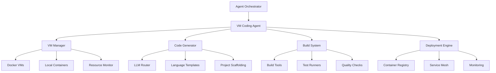

# VM Coding Agent

🤖 **Autonomous Virtual Machine and Code Generation Agent**

The VM Coding Agent is a sophisticated AI agent that can autonomously spin up virtual machines, generate code in multiple programming languages, build and test applications, and deploy services automatically. It integrates seamlessly with the Universal AI Tools agent orchestration system.

## 🎯 **Key Capabilities**

### 🖥️ **Virtual Machine Management**

- **On-Demand VM Creation**: Spin up virtual machines with custom specifications
- **Resource Allocation**: Intelligent CPU, memory, and storage management
- **Lifecycle Management**: Automatic VM provisioning, monitoring, and cleanup
- **Local Development**: Docker containers for isolated development environments

### 💻 **Multi-Language Code Generation**

- **Rust**: Web services, CLI tools, system programming
- **Go**: Microservices, APIs, concurrent applications
- **Python**: Data processing, ML models, web applications
- **TypeScript**: Web APIs, frontend applications
- **JavaScript**: Node.js applications, scripts
- **Swift**: iOS/macOS applications
- **Java**: Enterprise applications
- **C++**: Performance-critical applications

### 🏗️ **Automated Development Workflow**

- **Project Structure**: Generate complete project scaffolding
- **Dependency Management**: Automatic package/dependency installation
- **Build Systems**: Configure build tools (Cargo, npm, pip, etc.)
- **Test Frameworks**: Set up testing infrastructure
- **Code Quality**: Linting, formatting, static analysis

### 🚀 **Deployment & Operations**

- **Containerization**: Automatic Docker image creation
- **Service Deployment**: Deploy to various targets (Docker, K8s, cloud)
- **Health Monitoring**: Continuous health checks and monitoring
- **Resource Cleanup**: Automatic cleanup of unused resources

### 🤖 **Intelligent Task Processing**

- **Natural Language Parsing**: Understand task descriptions in plain English
- **Requirement Extraction**: Automatically extract technical requirements
- **Test Case Generation**: Generate comprehensive test cases
- **Complexity Assessment**: Evaluate task complexity and resource needs

## 🏗️ **Architecture**



## 🚀 **Quick Start**

### 1. **Build the Agent**

```bash
cd crates/vm-coding-agent
cargo build --release
```

### 2. **Run the Demo**

```bash
# Run the standalone demo
cargo run --bin vm-coding-agent

# Or run the Python demo script
python3 vm_coding_agent_demo.py
```

### 3. **Integrate with Orchestrator**

```rust
use vm_coding_agent::{VMCodingAgent, VMCodingConfig, CodingTask, ProgrammingLanguage, DeploymentTarget, TaskComplexity};
use vm_coding_agent::orchestrator_integration::OrchestratedVMCodingAgent;

#[tokio::main]
async fn main() -> Result<(), Box<dyn std::error::Error>> {
    // Create VM Coding Agent configuration
    let config = VMCodingConfig {
        max_concurrent_vms: 3,
        default_vm_specs: VMSpecs {
            cpu_cores: 2,
            memory_gb: 4,
            storage_gb: 20,
            os_image: "ubuntu:22.04".to_string(),
            network_config: NetworkConfig {
                allow_internet: true,
                port_mappings: vec![],
                firewall_rules: vec![],
            },
        },
        supported_languages: vec![
            ProgrammingLanguage::Rust,
            ProgrammingLanguage::Go,
            ProgrammingLanguage::Python,
        ],
        auto_cleanup_enabled: true,
        max_vm_lifetime_hours: 24,
        code_generation_models: vec!["llama3.2:3b".to_string()],
        deployment_targets: vec![DeploymentTarget::Docker],
    };

    // Create orchestrated agent
    let mut agent = OrchestratedVMCodingAgent::new(config).await?;

    // Submit a coding task
    let task = CodingTask {
        id: Uuid::new_v4(),
        description: "Create a REST API service in Rust".to_string(),
        language: ProgrammingLanguage::Rust,
        requirements: vec!["Use Tokio for async runtime".to_string()],
        test_cases: vec!["Test API endpoints".to_string()],
        deployment_target: DeploymentTarget::Docker,
        estimated_complexity: TaskComplexity::Medium,
        deadline: None,
    };

    let task_id = agent.submit_coding_task(task).await?;
    println!("Task submitted: {}", task_id);

    // Process tasks
    agent.start_processing_loop().await?;

    Ok(())
}
```

## 📋 **Usage Examples**

### **Example 1: Rust Web Service**

```rust
let task = CodingTask {
    description: "Create a REST API service in Rust with user management".to_string(),
    language: ProgrammingLanguage::Rust,
    requirements: vec![
        "Use Tokio for async runtime".to_string(),
        "Implement CRUD operations".to_string(),
        "Add JWT authentication".to_string(),
    ],
    test_cases: vec![
        "Test user creation endpoint".to_string(),
        "Test authentication flow".to_string(),
    ],
    deployment_target: DeploymentTarget::Docker,
    estimated_complexity: TaskComplexity::Medium,
    deadline: None,
};
```

### **Example 2: Python Data Service**

```rust
let task = CodingTask {
    description: "Create a Python service for CSV processing and report generation".to_string(),
    language: ProgrammingLanguage::Python,
    requirements: vec![
        "Use pandas for data manipulation".to_string(),
        "Generate PDF reports".to_string(),
        "Handle large files efficiently".to_string(),
    ],
    test_cases: vec![
        "Test CSV file processing".to_string(),
        "Test report generation".to_string(),
    ],
    deployment_target: DeploymentTarget::Docker,
    estimated_complexity: TaskComplexity::Simple,
    deadline: None,
};
```

### **Example 3: Go Microservice**

```rust
let task = CodingTask {
    description: "Create a Go microservice for authentication and JWT tokens".to_string(),
    language: ProgrammingLanguage::Go,
    requirements: vec![
        "Use Gin framework".to_string(),
        "Implement JWT token generation".to_string(),
        "Add password hashing with bcrypt".to_string(),
    ],
    test_cases: vec![
        "Test user registration".to_string(),
        "Test JWT token validation".to_string(),
    ],
    deployment_target: DeploymentTarget::Docker,
    estimated_complexity: TaskComplexity::Medium,
    deadline: None,
};
```

## 🔧 **Configuration**

### **VM Specifications**

```rust
VMSpecs {
    cpu_cores: 2,           // Number of CPU cores
    memory_gb: 4,           // Memory in GB
    storage_gb: 20,         // Storage in GB
    os_image: "ubuntu:22.04", // OS image
    network_config: NetworkConfig {
        allow_internet: true,
        port_mappings: vec![
            PortMapping {
                host_port: 8080,
                vm_port: 8080,
                protocol: "tcp".to_string(),
            },
        ],
        firewall_rules: vec![],
    },
}
```

### **Agent Configuration**

```rust
VMCodingConfig {
    max_concurrent_vms: 3,                    // Max VMs running simultaneously
    default_vm_specs: VMSpecs { ... },        // Default VM specifications
    supported_languages: vec![...],            // Supported programming languages
    auto_cleanup_enabled: true,                // Auto cleanup of resources
    max_vm_lifetime_hours: 24,                // Max VM lifetime
    code_generation_models: vec![...],         // LLM models for code generation
    deployment_targets: vec![...],             // Supported deployment targets
}
```

## 🔌 **Integration Points**

### **With Agent Orchestrator**

The VM Coding Agent integrates seamlessly with the Universal AI Tools agent orchestrator:

- **Agent Registration**: Automatically registers as a specialist agent
- **Task Queue**: Receives tasks from the orchestrator
- **Resource Management**: Reports resource usage to orchestrator
- **Status Updates**: Provides real-time status updates
- **Collaboration**: Can collaborate with other agents

### **With LLM Router**

- **Code Generation**: Uses LLM Router for intelligent code generation
- **Requirement Analysis**: Leverages LLM for understanding task requirements
- **Test Generation**: Generates test cases using LLM capabilities

### **With Memory Service**

- **Task History**: Stores completed task history
- **Learning**: Learns from past tasks to improve future performance
- **Context Preservation**: Maintains context across multiple tasks

## 📊 **Monitoring & Observability**

### **Metrics**

- **VM Metrics**: CPU, memory, storage usage per VM
- **Task Metrics**: Success rate, execution time, quality scores
- **Resource Metrics**: Overall resource utilization
- **Performance Metrics**: Build time, test time, deployment time

### **Health Checks**

- **VM Health**: Continuous monitoring of VM status
- **Service Health**: Health checks for deployed services
- **Agent Health**: Overall agent health and performance

### **Logging**

- **Structured Logging**: Comprehensive logging with structured data
- **Task Tracking**: Detailed logs for each task execution
- **Error Tracking**: Error logging and debugging information

## 🛡️ **Security**

### **VM Security**

- **Network Isolation**: VMs run in isolated networks
- **Firewall Rules**: Configurable firewall rules
- **Access Control**: SSH key-based access control
- **Resource Limits**: Strict resource limits to prevent abuse

### **Code Security**

- **Dependency Scanning**: Automatic scanning of dependencies for vulnerabilities
- **Static Analysis**: Code quality and security analysis
- **Secrets Management**: Secure handling of API keys and secrets

## 🚀 **Deployment Targets**

### **Docker**

- **Container Images**: Automatic Docker image creation
- **Multi-stage Builds**: Optimized container builds
- **Health Checks**: Built-in health check endpoints

### **Kubernetes**

- **Manifest Generation**: Automatic K8s manifest generation
- **Service Mesh**: Integration with service mesh
- **Scaling**: Automatic scaling based on load

### **Local Deployment Platforms**

- **Docker**: Container-based deployment
- **Kubernetes**: Local K8s cluster deployment
- **Local Services**: Direct local service deployment

## 🔮 **Future Enhancements**

### **Planned Features**

- **Local Kubernetes**: Support for local Kubernetes deployment
- **Advanced LLM Integration**: Better integration with LLM Router
- **Real-time Collaboration**: Multiple agents working on same project
- **Advanced Monitoring**: Prometheus/Grafana integration
- **CI/CD Integration**: Integration with existing CI/CD pipelines

### **Research Areas**

- **Autonomous Debugging**: Automatic bug detection and fixing
- **Performance Optimization**: Automatic performance optimization
- **Security Hardening**: Automatic security improvements
- **Code Review**: Automatic code review and suggestions

## 🤝 **Contributing**

We welcome contributions! Please see our [Contributing Guide](../../CONTRIBUTING.md) for details.

### **Development Setup**

```bash
# Clone the repository
git clone https://github.com/your-org/universal-ai-tools.git
cd universal-ai-tools

# Build the VM Coding Agent
cargo build -p vm-coding-agent

# Run tests
cargo test -p vm-coding-agent

# Run the demo
cargo run -p vm-coding-agent --bin vm-coding-agent
```

## 📄 **License**

This project is licensed under the MIT License - see the [LICENSE](../../LICENSE) file for details.

## 🙏 **Acknowledgments**

- **Universal AI Tools Team**: For the amazing orchestration platform
- **Rust Community**: For the excellent ecosystem
- **Docker Team**: For containerization capabilities
- **Open Source Contributors**: For all the amazing tools and libraries

---

**Ready to let agents code for you? The VM Coding Agent makes it possible!** 🚀
