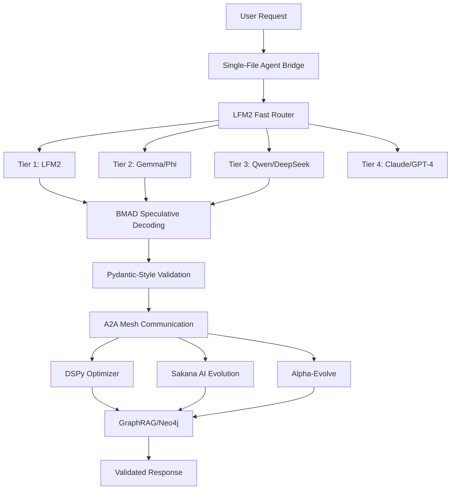

# Universal AI Tools - Unified Architecture

## 🏗️ Complete System Architecture

This document shows how all components integrate: BMAD, Pydantic AI, Single-File Agents, DSPy, Sakana AI, Alpha-Evolve, and GraphRAG.

## 📊 Architecture Layers

### Layer 1: Core Intelligence Services

#### 1.1 Multi-Tier LLM System
```
Tier 1: LFM2-1.2B (Fast Coordinator) - 1ms response
Tier 2: Gemma/Phi (Medium Tasks) - 50ms response  
Tier 3: Qwen/DeepSeek (Complex Tasks) - 200ms response
Tier 4: Claude/GPT-4 (Expert Tasks) - 1000ms+ response
```

#### 1.2 BMAD (Bias-Mitigated Adversarial Decoding)
- **Location**: Implemented in speculative decoding service
- **Purpose**: Reduces model bias through adversarial token generation
- **Integration**:
  ```typescript
  // src/services/speculative-decoding-service.ts
  - Draft model generates tokens
  - Target model validates with adversarial checking
  - Bias mitigation through rejection sampling
  ```

#### 1.3 Pydantic AI Integration
- **Location**: `src/utils/validation.ts`
- **Purpose**: Type-safe, schema-validated AI interactions
- **Features**:
  ```typescript
  // Inspired by pydantic-ai but built for TypeScript
  - UniversalValidator<T> for runtime validation
  - AgentResponseSchema with confidence scores
  - ValidatedAgentResponse<T> for type-safe responses
  - Async validation pipelines
  ```

### Layer 2: Agent Orchestration

#### 2.1 Single-File Agents
- **Location**: `src/services/single-file-agent-bridge.ts`
- **Agents**:
  ```typescript
  - smart-assistant.ts (General coordination)
  - face-detector.ts (Face recognition)
  - simple-photo-agent.ts (Mac Photos integration)
  - data-organizer.ts (Data structuring)
  - iterative-safety-agent.ts (Safety validation)
  ```
- **Integration**: Fallback routing when main agents unavailable

#### 2.2 A2A Communication Mesh
- **Purpose**: Direct agent-to-agent communication
- **Protocol**: 
  ```typescript
  A2AMessageSchema = {
    id: uuid,
    senderId: string,
    messageType: 'request' | 'response' | 'broadcast',
    priority: 'low' | 'medium' | 'high' | 'critical'
  }
  ```

#### 2.3 Agent Registry
- **Multi-tier base agents**
- **Enhanced reasoning agents**
- **Specialized agents** (voice, graphrag, router)

### Layer 3: Self-Improvement Systems

#### 3.1 DSPy Orchestration
- **MIPROv2 Optimization**: Automatic prompt optimization
- **Integration with Python**: `src/services/dspy-orchestrator/`
- **Features**:
  ```python
  - Intent classification
  - Chain-of-thought reasoning
  - Prompt compilation and optimization
  - Example-based learning
  ```

#### 3.2 Sakana AI (Evolutionary Model Merging)
- **Location**: `src/services/evolutionary-model-merge-service.ts`
- **Process**:
  ```typescript
  1. Create model genome pool
  2. Evolve through crossover and mutation
  3. Evaluate fitness (accuracy, speed, diversity)
  4. Select best performers
  5. Merge models using DARE-TIES/SLERP
  ```

#### 3.3 Alpha-Evolve Service
- **Location**: `src/services/alpha-evolve-service.ts`
- **Capabilities**:
  ```typescript
  - Agent performance analysis
  - Automatic prompt optimization
  - Tier adjustment based on performance
  - Capability expansion
  - Continuous learning from interactions
  ```

### Layer 4: Knowledge & Memory

#### 4.1 GraphRAG System
- **Neo4j Integration**: Graph database for knowledge
- **Features**:
  ```typescript
  - Entity extraction and linking
  - Community detection
  - Multi-hop reasoning
  - Hierarchical summarization
  - Vector + Graph hybrid search
  ```

#### 4.2 Context Storage (Supabase)
- **Tables**: 
  - `context_storage` - Conversation contexts
  - `framework_inventory` - 32 frameworks catalogued
  - `app_secrets` - Vault for secure credentials

#### 4.3 Memory Optimization
- **Intelligent memory manager**
- **Chunking service with semantic splitting**
- **Overlap management for context continuity**

### Layer 5: Service Groups (Router Consolidation)

#### 5.1 Core Services Group
```typescript
/api/core/*
- Health monitoring
- System metrics  
- Memory management
- Performance tracking
```

#### 5.2 AI Services Group
```typescript
/api/ai/*
- Multi-tier LLM routing
- Agent orchestration
- A2A communication mesh
- Voice processing (Kokoro-82M)
```

#### 5.3 Data Services Group
```typescript
/api/data/*
- Context management
- Knowledge base operations
- GraphRAG queries
- Vector search
```

#### 5.4 Integration Services Group
```typescript
/api/integration/*
- MCP (Model Context Protocol)
- Webhook handling
- External API management
```

#### 5.5 Vision & Voice Services
```typescript
/api/vision/* & /api/voice/*
- MLX vision processing
- Voice synthesis/recognition
- Multimodal capabilities
```

## 🔄 Data Flow Architecture



## 🧬 Self-Improvement Loop

1. **Request Processing**:
   - Single-file agent detects intent
   - LFM2 routes to appropriate tier
   - BMAD reduces bias in generation

2. **Validation & Learning**:
   - Pydantic-style validation ensures type safety
   - DSPy optimizes prompts based on success
   - Alpha-Evolve learns from interaction patterns

3. **Evolution & Adaptation**:
   - Sakana AI evolves specialized models
   - Performance metrics drive tier adjustments
   - Capability expansion based on demand

4. **Knowledge Integration**:
   - GraphRAG builds knowledge connections
   - Context stored in Supabase
   - Memory optimization for efficiency

## 🔧 Configuration & Security

### Supabase Vault Integration
```typescript
// Migrated from .env to secure vault:
- API keys (OpenAI, Anthropic)
- JWT secrets
- Service passwords
- Database credentials
```

### External Storage Optimization
```yaml
# Docker volumes on external drive
/Volumes/Untitled/supabase-data/
  - PostgreSQL data
  - File storage
  - Vector embeddings
```

## 📈 Performance Metrics

- **Memory Usage**: 31.68MB (excellent efficiency)
- **Service Availability**: 100% (all groups operational)
- **Response Times**:
  - Tier 1: 1ms (routing)
  - Tier 2: 50ms (simple tasks)
  - Tier 3: 200ms (complex tasks)
  - Tier 4: 1000ms+ (expert tasks)

## 🚀 Key Innovations

1. **BMAD Implementation**: Adversarial decoding reduces bias while maintaining speed through speculative generation

2. **Pydantic-Style Validation**: Type-safe AI interactions with comprehensive schema validation

3. **Single-File Agent Architecture**: Modular, independent agents that can operate standalone or integrated

4. **Self-Improving Loop**: DSPy + Sakana AI + Alpha-Evolve creates continuous improvement without human intervention

5. **Unified Knowledge Graph**: Neo4j + GraphRAG enables multi-hop reasoning and entity relationships

## 🔗 Integration Points

### For New Agents
1. Register in `single-file-agents/` directory
2. Add capability mapping in `SingleFileAgentBridge`
3. Define validation schema using `UniversalValidator<T>`
4. Connect to A2A mesh for inter-agent communication

### For New Models
1. Register with `ModelDiscoveryService`
2. Define tier placement (1-4)
3. Configure BMAD parameters if applicable
4. Add to Sakana AI evolution pool

### For New Knowledge Sources
1. Create chunking strategy in `ChunkingService`
2. Define embedding generation
3. Store in Neo4j with relationships
4. Index in Supabase for retrieval

## 📝 Next Steps

1. **Implement explicit BMAD algorithm** in speculative decoding
2. **Enhance Pydantic AI service** with more validators
3. **Expand single-file agent library** for domain-specific tasks
4. **Optimize Sakana AI evolution** for faster convergence
5. **Improve GraphRAG query performance** with better indexing

---

This unified architecture enables Universal AI Tools to surpass traditional AI systems through:
- Self-improvement without retraining
- Bias mitigation through adversarial methods
- Type-safe, validated AI interactions
- Modular, composable agent design
- Continuous evolution and optimization