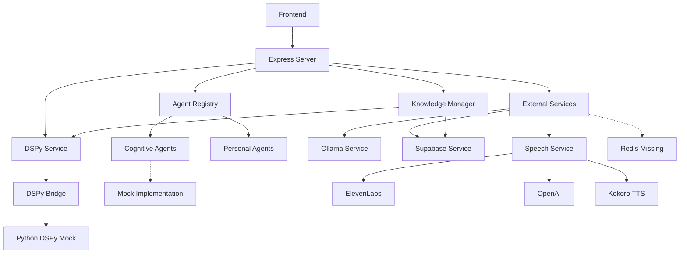

# Service Integration Assessment Report
**Universal AI Tools Platform**
*Generated: 2025-07-20*

## Executive Summary

The Universal AI Tools platform demonstrates a modular architecture with multiple service integrations. However, the assessment reveals significant gaps between mock implementations and production-ready services. Most core services are in a prototype or development state, with heavy reliance on mock implementations and disabled features.

### Key Findings
- **DSPy Orchestration**: Mock implementation only, disabled by default
- **Agent System**: Lazy-loading architecture with mock cognitive agents
- **External Services**: Mixed maturity - Ollama and Supabase operational, Redis missing, Voice services multi-provider
- **Memory/Knowledge**: DSPy-based with Supabase backend, MIPROv2 optimization available

## 1. DSPy Orchestration System

### Implementation Status
- **Location**: `/src/services/dspy-orchestrator/bridge.ts`, `/src/services/dspy-service.ts`
- **Status**: **MOCK ONLY** - No production Python service implemented
- **Default State**: DISABLED (requires `ENABLE_DSPY_MOCK=true`)

### Architecture
```
DSPyService → DSPyBridge → WebSocket → Python Mock Server (if enabled)
```

### Key Issues
1. **No Real Implementation**: Only mock server exists (`mock_server.py` referenced but not found)
2. **Disabled by Default**: Service won't start unless explicitly enabled
3. **WebSocket Dependency**: Relies on WebSocket connection to Python service
4. **Circuit Breaker Missing**: No circuit breaker protection for DSPy operations

### Mock vs Production Gap
- Mock provides basic request/response simulation
- No actual DSPy optimization or knowledge management
- Missing Python DSPy backend entirely

## 2. Agent System Architecture

### Implementation Status
- **Registry**: `/src/agents/universal_agent_registry.ts` - OPERATIONAL
- **Base Agent**: `/src/agents/base_agent.ts` - OPERATIONAL
- **Cognitive Agents**: MOCK ONLY
- **Personal Agents**: PARTIALLY IMPLEMENTED

### Agent Categories
1. **Core Agents** (10 defined):
   - Planner, Retriever, Orchestrator, User Intent, Ethics
   - ALL USE MOCK IMPLEMENTATION (`mock_cognitive_agent.ts`)

2. **Personal Agents** (8 defined):
   - Calendar, Photo Organizer, File Manager, Code Assistant, etc.
   - Some have real implementations, others missing

### Lazy Loading System
- Efficient lazy loading with concurrent loading prevention
- Memory coordination support (when available)
- Automatic idle agent unloading

### Issues
1. **Mock Cognitive Agents**: All cognitive agents return to mock implementation
2. **Missing Dependencies**: Many agents depend on 'ollama_assistant' which may not exist
3. **No Circuit Breaker**: Agent execution lacks circuit breaker protection despite imports

## 3. External Service Integrations

### 3.1 Ollama Integration
- **Status**: OPERATIONAL
- **Location**: `/src/services/ollama_service.ts`
- **Features**:
  - Health checking with circuit breaker
  - Model management (list, pull, delete)
  - Text generation and embeddings
  - Metal optimization for Apple Silicon
- **Issues**:
  - Assumes local Ollama instance at `localhost:11434`
  - No authentication mechanism

### 3.2 Supabase Integration
- **Status**: OPERATIONAL
- **Location**: `/src/services/supabase_service.ts`
- **Features**:
  - Singleton pattern implementation
  - Context and memory storage
  - Generic CRUD operations
  - Vector similarity search (placeholder)
- **Issues**:
  - No connection pooling
  - Missing error recovery
  - Vector search not implemented

### 3.3 Redis Integration
- **Status**: NOT FOUND
- **Expected Features**: Caching, session management, rate limiting
- **Impact**: No distributed caching available

### 3.4 Voice/Speech Services
- **Status**: MULTI-PROVIDER WITH FALLBACK
- **Location**: `/src/services/speech-service.ts`
- **Providers**:
  1. ElevenLabs (Premium TTS)
  2. OpenAI (Whisper + TTS)
  3. Kokoro (Local TTS)
  4. Mock (Development)
- **Features**:
  - Automatic provider fallback
  - Audio validation and processing
  - Multiple voice profiles
  - Retry mechanism
- **Issues**:
  - Complex provider management
  - Kokoro TTS implementation status unclear

## 4. Memory and Knowledge Systems

### Implementation
- **Status**: OPERATIONAL WITH LIMITATIONS
- **Location**: `/src/core/knowledge/dspy-knowledge-manager.ts`
- **Backend**: Supabase with pgvector (planned)

### Features
1. **DSPy Integration**:
   - Knowledge extraction and enrichment
   - Intelligent search (when DSPy enabled)
   - Knowledge evolution
   - MIPROv2 optimization support

2. **Storage**:
   - Supabase backend
   - Local caching
   - Usage tracking
   - Performance metrics

### Issues
1. **DSPy Dependency**: Advanced features require DSPy service (disabled by default)
2. **Vector Search**: Not implemented despite interface
3. **Table Creation**: Requires manual database setup

## 5. Service Dependency Map



## 6. Production Readiness Assessment

### Ready for Production
1. **Supabase Service**: Basic operations functional
2. **Ollama Integration**: With proper local setup
3. **Agent Registry**: Lazy loading system works

### Requires Significant Work
1. **DSPy System**: Needs complete Python backend
2. **Cognitive Agents**: All need real implementations
3. **Vector Search**: Not implemented
4. **Redis/Caching**: Completely missing

### Development/Prototype Stage
1. **Knowledge Manager**: Works but limited without DSPy
2. **Speech Services**: Complex but functional with API keys
3. **Personal Agents**: Partially implemented

## 7. Performance and Reliability

### Circuit Breaker Status
- **Imported but not used** in most services
- Only Ollama service uses decorators
- Critical for production reliability

### Failover Mechanisms
1. **Speech Service**: Good multi-provider fallback
2. **DSPy**: No fallback when disabled
3. **Agents**: Return to mock but no graceful degradation

### Performance Bottlenecks
1. **No Redis**: All caching is in-memory only
2. **Synchronous Operations**: Many async operations not properly handled
3. **WebSocket Dependency**: DSPy requires persistent connection

## 8. Recommendations

### Immediate Actions
1. **Enable Circuit Breakers**: Implement across all external service calls
2. **Add Redis**: Critical for distributed caching and session management
3. **Implement Real DSPy Backend**: Current mock is not sufficient

### Short-term Improvements
1. **Implement Cognitive Agents**: Replace mocks with real implementations
2. **Add Connection Pooling**: For Supabase and other services
3. **Improve Error Handling**: Consistent error patterns across services

### Long-term Strategy
1. **Service Mesh**: Consider implementing service mesh for better orchestration
2. **Monitoring**: Add comprehensive monitoring and alerting
3. **API Gateway**: Centralize external service management

## 9. Security Considerations

### Current Issues
1. **No Authentication**: Between services
2. **Exposed Endpoints**: Internal services accessible
3. **Missing Rate Limiting**: Without Redis
4. **API Keys**: Hardcoded in environment variables

### Recommendations
1. Implement service-to-service authentication
2. Add API gateway with rate limiting
3. Use secrets management system
4. Implement request validation

## 10. Conclusion

The Universal AI Tools platform shows promise with its modular architecture but is not production-ready. The heavy reliance on mock implementations, disabled core features (DSPy), and missing critical infrastructure (Redis) indicate this is still in early development stages.

**Production Readiness Score: 3/10**

Key blockers for production:
1. No real DSPy implementation
2. All cognitive agents are mocks
3. Missing Redis infrastructure
4. Incomplete circuit breaker implementation
5. No monitoring or observability

The platform would benefit from focusing on implementing one complete vertical slice (e.g., one real cognitive agent with full DSPy integration) before expanding horizontally.