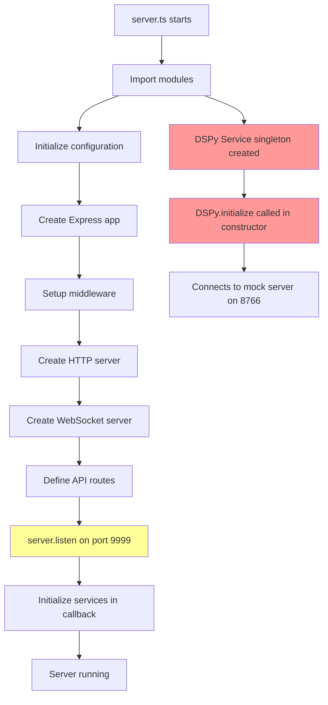
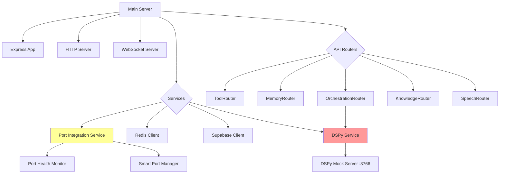
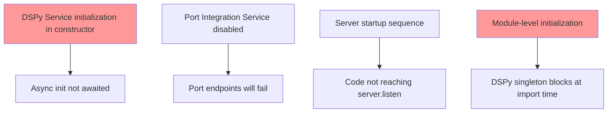

# Universal AI Tools Server Architecture & Startup Flow

## Server Startup Flow



## API Endpoints Structure

```mermaid
graph LR
    API[/api] --> Health[/health]
    API --> V1[/v1]
    API --> Legacy[Legacy Routes]

    V1 --> V1Tools[/tools]
    V1 --> V1Memory[/memory]
    V1 --> V1Context[/context]
    V1 --> V1Knowledge[/knowledge]
    V1 --> V1Orchestration[/orchestration]
    V1 --> V1Speech[/speech]
    V1 --> V1Docs[/docs]
    V1 --> V1Backup[/backup]

    Legacy --> LTools[/tools]
    Legacy --> LMemory[/memory]
    Legacy --> LContext[/context]
    Legacy --> LKnowledge[/knowledge]
    Legacy --> LOrchestration[/orchestration]

    API --> Ports[/ports]
    Ports --> PortStatus[/status]
    Ports --> PortReport[/report]
    Ports --> PortHealth[/health-check]
    Ports --> PortResolve[/resolve-conflict]

    API --> Performance[/performance]
    Performance --> PerfMetrics[/metrics]
    Performance --> PerfReport[/report]

    API --> Assistant[/assistant]
    Assistant --> Chat[/chat]
    Assistant --> SuggestTools[/suggest-tools]
    Assistant --> GenIntegration[/generate-integration]
    Assistant --> RouteRequest[/route-request]

    style Ports fill:#ff9999
```

## Service Dependencies



## Potential Issues Identified


